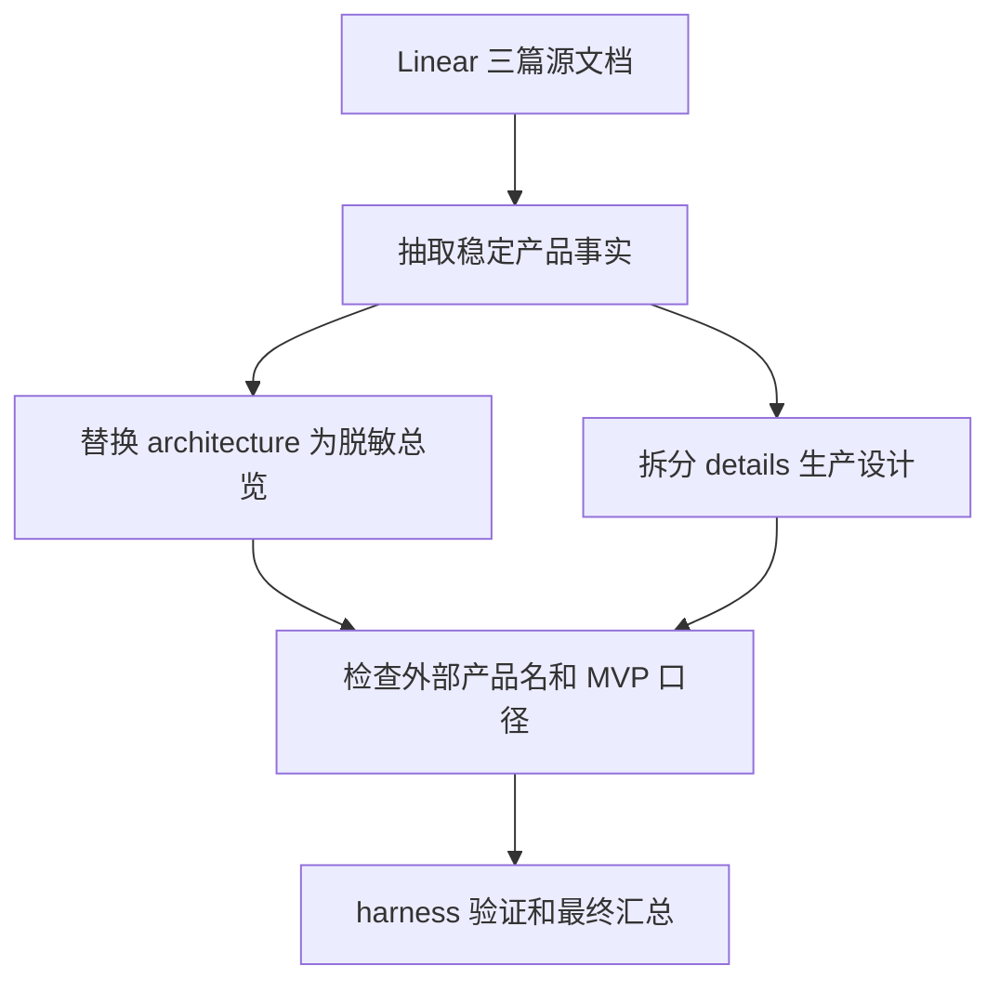

# ExecPlan: production design docs refinement

## Goal

基于 Linear project `tuyu-studio` 中的三篇源文档，重做仓库内 `docs/design` 设计稿：

- 删除 `docs/design/architecture` 下原有三篇直接源文档。
- 用一份脱敏架构总览替代原文档，避免把外部平台、竞品或实现供应商名称写成产品主叙事。
- 在 `docs/design/details` 下补齐面向生产交付的细节设计稿，覆盖产品边界、领域模型、文件结构、画布、资产、指令编排、AI 任务、生成包、结果回收、前端交互、安全、验证和验收。

## Scope and Non-Goals

### Included

| 范围 | 说明 |
| --- | --- |
| Linear 文档读取 | 读取三篇源文档：命名建议、产品需求、技术架构 |
| architecture 清理 | 删除原 3 篇 architecture 源文档，补 1 篇脱敏架构总览 |
| details 细化 | 新建 `docs/design/details` 并按生产可用方案拆分细节设计 |
| repo 索引 | 新建 `docs/design/README.md` 作为设计稿入口 |
| 脱敏检查 | 检查 docs/design 中是否仍大量出现外部产品名或 `MVP` 口径 |

### Excluded

| 不纳入 | 原因 |
| --- | --- |
| 代码实现 | 本轮只重做设计稿 |
| Linear issue / doc 写回 | 用户目标是把 Linear 文档沉淀到 repo 设计稿，不要求外部系统更新 |
| 技术选型定稿到第三方品牌 | architecture 改为供应商无关表达，具体实现可后续由执行 issue 决定 |
| 真实视频平台 API 对接 | 当前只设计手动交接和可替换 provider 边界 |

## Scope Freeze

本轮只改以下路径：

- `.agents/plans/2026-05-14-design-docs-production-refine.md`
- `docs/design/README.md`
- `docs/design/architecture/*`
- `docs/design/details/**`

禁止把设计目标降级为 `MVP`、演示版或临时补丁。细节设计必须按生产可用闭环书写，包括异常处理、数据一致性、审计追溯、脱敏、安全边界和验收标准。

## Context and Orientation

当前仓库处于 harness 初始化后、产品设计尚未沉淀成稳定 repo 文档的阶段。Linear project 中三篇文档分别提供：

- 命名和品牌方向：产品应以 `图屿 / Tuyu Studio` 为主，不把自己绑定到某个供应商或平台。
- 产品需求方向：本地 AI 影视前期制作台，核心是创作图谱、资产连续性、指令编排、生成包导出和结果回收。
- 技术架构方向：桌面应用、本地后端、画布前端、AI 任务运行时、文件型项目存储和 provider 适配层。

本轮处理方式：

- architecture 只留下可公开、可复用、供应商无关的系统分层。
- details 承接真正可执行设计，并把外部集成统一抽象成 `AI 任务运行时`、`图像生成适配器`、`视频生成交接适配器`。

## Architecture / Data Flow

### 真实入口与触发

入口是本地设计文档更新。触发来自用户明确目标：通过 Linear project 三篇文档细化 `docs/design`，并删除原 architecture 下三篇含外部产品名过多的文档。

- `入口命令 / 调用源`: 用户目标驱动的 docs-only 更新；输入来自 Linear project 三篇文档和当前仓库 `docs/design`。
- `入口代码位置`: 本轮不改业务代码，入口落点是 `.agents/plans/2026-05-14-design-docs-production-refine.md` 与 `docs/design/**` 文档文件。
- `触发条件 / 上游依赖`: Linear 文档可读、本地仓库位于 `/Users/suqing/Coding/golang/00_self/tuyu-studio`、用户明确要求删除旧 architecture 三篇并补生产级 details。

### 输入装配与边界校验

| 输入 | 装配方式 | 拒绝 / 收敛规则 |
| --- | --- | --- |
| Linear 命名文档 | 提取品牌、命名、产品调性 | 不把备选供应商名写入 architecture |
| Linear PRD | 提取产品目标、用户、工作流、需求矩阵 | 去掉 `MVP` 降级口径，改为生产完整闭环 |
| Linear 架构文档 | 提取分层、数据模型、运行时、导出、沙箱 | 外部平台名改为 adapter / provider 抽象 |
| 本地原文档 | 用于确认现有文件和待删范围 | 原 3 篇不做原地微调，直接替换为脱敏版本 |

- `输入来源`: Linear project `tuyu-studio` 的命名建议、产品需求、技术架构三篇文档，以及本地 `docs/design/architecture` 原三篇文档。
- `装配位置`: 汇总到 `docs/design/README.md`、`docs/design/architecture/redacted-production-architecture.md`、`docs/design/details/README.md` 和 `docs/design/details/00-*` 到 `09-*` 模块目录。
- `装配结果 / 核心对象`: 1 个脱敏架构入口、1 个设计总入口、1 个 details 索引、10 个模块 README 和 39 个生产细节子文档。
- `边界校验`: 正式 `docs/design` 不保留源文档中的外部品牌主叙事，不使用降级口径，不写真实凭据、本机路径或外部平台私有细节。

### 组件职责与代码落点

本轮是文档任务，不改代码。目标文档职责如下：

| 路径 | 职责 |
| --- | --- |
| `docs/design/README.md` | 设计稿入口、阅读顺序、范围说明 |
| `docs/design/architecture/redacted-production-architecture.md` | 脱敏架构总览，只表达系统边界和核心数据流 |
| `docs/design/details/00-product-scope-and-glossary/README.md` | 产品边界、术语和非目标总览，子文档细化边界、用户路径和术语 |
| `docs/design/details/01-local-project-storage/README.md` | 本地项目、文件结构、保存、迁移、锁和恢复总览，子文档细化目录、schema、锁和健康检查 |
| `docs/design/details/02-creative-graph-domain-model/README.md` | Creative Graph 节点、边、状态和一致性总览，子文档细化关系、状态机、上下文和一致性规则 |
| `docs/design/details/03-asset-library-and-continuity/README.md` | 人物、场景、道具、参考图和连续性治理总览，子文档细化导入、绑定、连续性和恢复 |
| `docs/design/details/04-script-shot-package-workflow/README.md` | 剧本、场次、分镜、生成包和结果回收总览，子文档细化拆场、镜头生命周期、导出和 review |
| `docs/design/details/05-instruction-stack-and-skills/README.md` | 指令栈、skill、prompt 编译和冲突处理总览，子文档细化编译顺序、能力路由、输出契约和冲突 |
| `docs/design/details/06-ai-runtime-and-provider-adapters/README.md` | AI runtime、图像适配器、视频交接适配器和错误语义总览，子文档细化 gateway、adapter 和重试 |
| `docs/design/details/07-frontend-workbench-experience/README.md` | 前端工作台、交互、状态、可访问性和生产操作体验总览，子文档细化布局、画布、面板和反馈 |
| `docs/design/details/08-security-privacy-observability/README.md` | 安全、隐私、脱敏、审计、可观测和权限总览，子文档细化路径守卫、脱敏、审计和恢复 |
| `docs/design/details/09-delivery-acceptance-and-test-plan/README.md` | 交付切片、验收矩阵和测试入口总览，子文档细化切片、矩阵、测试和发布准备 |

### 关键执行时序



- `步骤化时序`: 先读取 Linear 与本地文档，随后替换 architecture，再拆分 details，最后执行结构、敏感词和 harness 验证。

1. 读取 Linear 文档和本地源文档。
2. 删除 architecture 原 3 篇文档。
3. 新增 architecture 脱敏总览，保留产品名和通用系统抽象。
4. 新增 details 细节设计，保证每个生产能力都有输入、输出、状态、错误语义、验收。
5. 按模块拆分 spec 将 flat details 文档迁移为 `docs/design/details/00-*` 到 `09-*` 子目录，并补齐子文档。
6. 执行结构检查、旧 flat 链接检查、敏感词检查和 harness gate。

### 停止 / 错误 / 恢复

| 场景 | 处理 |
| --- | --- |
| Linear 读取失败 | 使用已读取本地源文档继续，但在最终说明残余风险 |
| docs/design 目录不存在 | 当前仓库已存在 `docs/design/architecture`，不需要另建仓库 |
| 外部产品名无法完全移除 | architecture 必须脱敏；details 如必须表达外部依赖，改为 provider 抽象 |
| harness gate 失败 | 先修文档结构问题；非本轮范围问题在最终说明 |

- `正常停止条件`: `docs/design` 文件结构、敏感词检查、`make harness-check` 和 `make harness-review-gate` 都通过。
- `主要错误出口`: Linear 读取失败、文档结构不完整、正式设计稿仍残留外部品牌主叙事、harness gate 失败。
- `关键分支 / 降级路径`: 如果外部平台名无法完全删除，则只允许作为 provider/profile 抽象出现；如果 review gate 失败，则先补 plan 或文档结构后重跑。
- `恢复 / 重试 / 回滚`: 本轮为 docs-only，可通过 git diff 定位改动；若中断，按本计划 Progress 继续补齐目标文件并重新执行验证命令。

## Concrete Steps

### 实现步骤

1. 新建计划文件并冻结范围。
2. 删除 `docs/design/architecture/tuyu-canvas-naming.md`、`tuyu-studio-requirements.md`、`tuyu-studio-architecture.md`。
3. 新增 `docs/design/architecture/redacted-production-architecture.md`。
4. 新增 `docs/design/README.md`。
5. 新增 `docs/design/details/*.md` 细节设计稿。
6. 按模块拆分 spec 将 flat details 文档迁移为 `docs/design/details/00-*` 到 `09-*` 子目录，并补齐子文档。
7. 运行结构、旧链接、敏感词和 `MVP` 口径检查。

### 验证与收口步骤

1. `find docs/design/details -maxdepth 3 -type f -print | sort`
2. `find docs/design/details -maxdepth 1 -type f -name '[0-9][0-9]-*.md' -print`
3. `rg -n "details/[0-9][0-9]-[^/]+\\.md" docs/design`
4. `rg -n "MVP|纳逗|可灵|Vidu|海螺|Wan|ComfyUI|Stable Diffusion|OpenAI|Codex|Wails|Ant Design|AntV|X6" docs/design`
5. `make harness-check`
6. `make harness-review-gate PLAN=.agents/plans/2026-05-14-design-docs-production-refine.md`

## Progress

| 步骤 | 状态 |
| --- | --- |
| 读取 Linear 源文档 | completed |
| 读取本地设计稿与 repo 规则 | completed |
| 写入计划 | completed |
| architecture 替换 | completed |
| details 细化 | completed |
| details 模块拆分与子文档细化 | completed |
| 验证 | completed |

## Decision Log

| 决策 | 结论 |
| --- | --- |
| architecture 是否保留三篇源文档 | 不保留，替换为一篇脱敏总览 |
| details 是否继续使用 `MVP` | 不使用，改为生产完整闭环 |
| 外部平台名称如何处理 | 统一抽象为 `AI 任务运行时`、`图像生成适配器`、`视频生成交接适配器` |
| 是否回写 Linear | 本轮不回写，除非用户后续要求 |

## Surprises & Discoveries

- 本轮执行 cwd 已确认是 `/Users/suqing/Coding/golang/00_self/tuyu-studio`。
- Linear project `tuyu-studio` 下共有三篇源文档：命名建议、产品需求、技术架构。
- 本地 `docs/design/architecture` 原先只有三篇直接源文档，本轮已替换为一个脱敏生产架构入口，并将细节设计拆到 `docs/design/details`。
- `docs/design/details` 已从 10 个 flat 模块文档继续拆成 10 个模块目录；每个模块保留 `README.md` 作为总览，并用子文档承接可执行规则、字段、状态、错误、恢复和验收口径。
- `tuyu-studio` 当前没有业务代码，设计文档是主执行真相的第一层沉淀。

## Reference Snippets

### 设计稿敏感抽象

```text
不要在 architecture 里写外部平台、竞品或供应商品牌名。
使用：
- AI 任务运行时
- 图像生成适配器
- 视频生成交接适配器
- 目标视频平台
- provider profile
```

### 生产验收口径

```text
每个细节设计至少覆盖：
输入、输出、状态、失败语义、恢复方式、可观测记录、验收标准。
```

## Validation and Acceptance

| 验收项 | 方式 |
| --- | --- |
| architecture 原 3 篇已删除 | `find docs/design/architecture -type f` |
| architecture 有脱敏总览 | 检查 `redacted-production-architecture.md` |
| details 覆盖生产细节 | 检查 `docs/design/details/README.md`、10 个模块 `README.md` 和 39 个子文档 |
| 不出现 `MVP` 降级口径 | `rg -n "MVP" docs/design` 应无结果 |
| 外部产品名不再主导设计稿 | 敏感词 `rg` 只允许计划或历史引用中出现，正式 docs/design 不应出现 |
| harness gate 通过 | `make harness-check`、`make harness-review-gate ...` |

## Idempotence and Recovery

本轮为 docs-only。若中断，恢复方式：

1. 重新读取本计划的 `Progress`。
2. 执行 `git status --short` 确认已改文件。
3. 若 architecture 三篇旧文档仍在，继续删除并写入脱敏总览。
4. 若 details 不完整，按模块目录补齐 00-09 的 `README.md` 和子文档。
5. 重新执行验证命令。

## Harness Control Plane

| 阶段 | 当前结论 |
| --- | --- |
| collect | 已读取 Linear 三篇文档、本地设计稿和 repo 规则 |
| gate | docs-only，可进入 |
| freeze | 范围冻结在 `docs/design` 和本计划 |
| slice | 单轮完成全部文档重写 |
| implement | 已完成 architecture 替换、设计入口、details 00-09 模块目录和子文档 |
| verify | 已通过结构检查、旧 flat 路径检查、敏感词检查、`make harness-check` 和 `make harness-review-gate` |
| review | 已做自审，阻塞问题为 none |
| writeback | 本轮仅 repo 文档，无 Linear 写回 |
| pr_prep | 本轮不创建 PR，除非用户后续要求 |
| merge | 本轮不 merge |
| notify | 最终回复列出文件和验证 |

## Issue Actions

本轮不创建、更新或关闭 Linear issue。Linear project 三篇文档只作为输入源。

## Verify Summary

- `find docs/design/details -maxdepth 3 -type f -print | sort` 已确认 details 输出 50 个文件：details README、10 个模块 README 和 39 个子文档。
- `find docs/design/details -maxdepth 1 -type f -name '[0-9][0-9]-*.md' -print` 无输出，旧 flat details 文档已移除。
- `rg -n "details/[0-9][0-9]-[^/]+\\.md" docs/design` 无输出，正式设计稿不再链接旧 flat 文档。
- `rg -n "MVP|纳逗|可灵|Vidu|海螺|Wan|ComfyUI|Stable Diffusion|OpenAI|Codex|Wails|Ant Design|AntV|X6" docs/design` 无结果。
- `rg -n "/Users/|cookie|secret|password|真实凭据|本机绝对路径" docs/design` 只命中安全/脱敏规则本身，没有真实凭据或本机路径。
- `make harness-check` 已通过。
- `make harness-review-gate PLAN=.agents/plans/2026-05-14-design-docs-production-refine.md` 已通过，`blocking_findings=none`。

## Review Summary

- blocking_findings: none
- 自审结论：正式 `docs/design` 已去掉原 source-style 三篇 architecture 文档，脱敏架构只保留系统分层和抽象适配器；details 已按模块目录和子文档补齐输入、输出、状态、错误、恢复、追溯和验收。

## Writeback Summary

- 写回面为 repo 文档：`docs/design/README.md`、`docs/design/architecture/redacted-production-architecture.md`、`docs/design/details/README.md`、`docs/design/details/00-*` 到 `09-*` 模块目录及其子文档。
- 本轮不写回 Linear document / issue。

## PR Prep Summary

不适用。

## Outcomes & Notify Summary

- 待最终验证完成后，在用户回复中列出文件结构、关键改动和验证命令。

## Outcomes & Retrospective

- 本轮关键取舍：architecture 保持脱敏和供应商无关；生产细节全部放入 details，避免把源材料直接作为长期设计稿。
