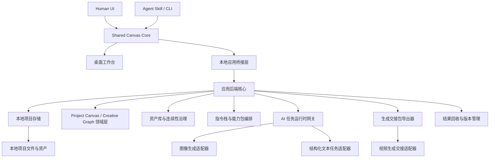
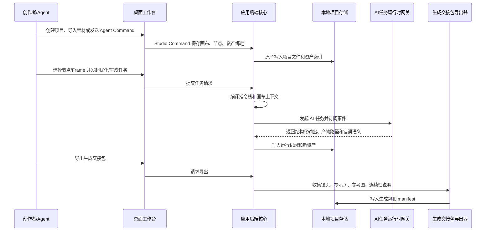
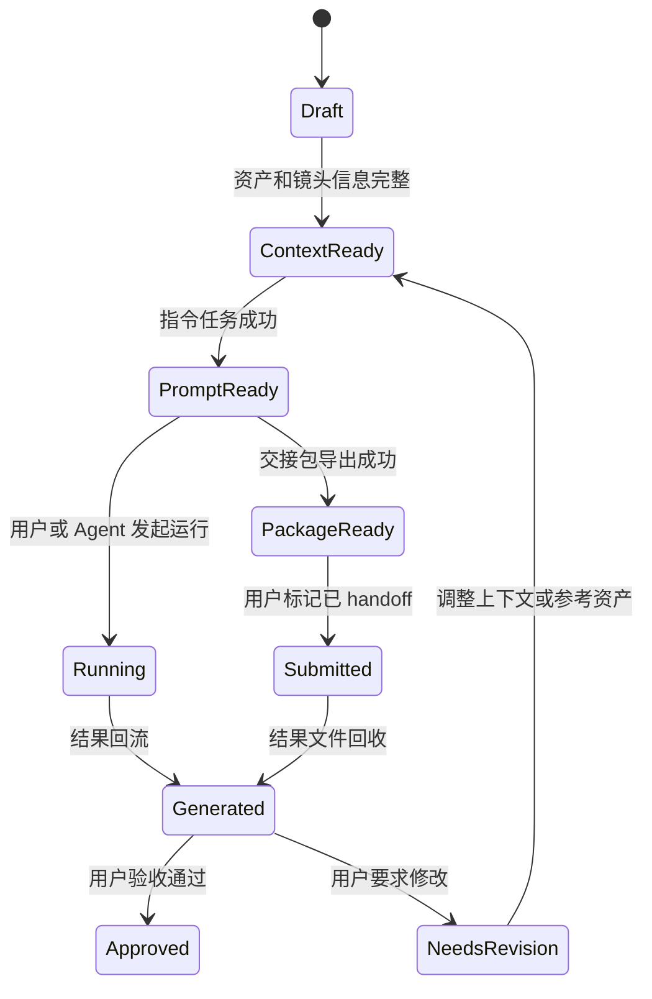

# 脱敏生产架构总览

## 目标

图屿是一个 Canvas-first 私有 AI 视频创作 Studio。它用 Project Canvas 组织剧本、角色、场景、道具、参考图、提示词、分镜、生成任务、交接包和结果文件，并通过 Shared Canvas Core、Studio Command、指令栈、能力包和 ProviderMode，把人类创作者与外部 Agent 的操作稳定转成可追溯、可复用、可运行、可交接的生产资产。

本架构总览只描述图屿自身的系统边界和抽象能力，不把任何外部模型、平台、框架或供应商名称写成核心架构事实。具体实现选型、目标平台和运行时能力由后续执行 issue 在 provider profile 或技术实现文档中登记。

当前落地技术栈登记见 `technology-stack.md`。该文档固定 Wails、Go 后端、Vue 3、TypeScript、Ant Design Vue 和 AntV 的实现职责，但不改变本文定义的产品领域边界和 provider 可替换原则。

## 系统分层



| 层 | 职责 | 不负责 |
| --- | --- | --- |
| Shared Canvas Core | 统一 UI、CLI、MCP 风格入口和外部 Agent 的 Studio Command、版本校验、审计和事件 | 直接渲染界面或绕过领域规则写文件 |
| 桌面工作台 | Project Canvas、面板、节点编辑、预览、命令入口、状态反馈 | 直接读写任意本机路径 |
| 本地应用桥接层 | 将前端命令收敛为后端方法调用和事件订阅 | 承接领域规则或文件系统策略 |
| 应用后端核心 | 编排项目、图谱、资产、指令、任务、生成包和结果 | 绑定单一外部供应商 |
| 本地项目存储 | 管理项目目录、数据文件、资产、运行记录、迁移和备份 | 存储真实凭据或跨项目共享私密资产 |
| Project Canvas / Creative Graph 领域层 | 维护节点、边、Frame、Blueprint、布局、引用关系和状态一致性 | 替代专业剪辑时间线 |
| 资产库与连续性治理 | 导入、分类、绑定、去重、来源追溯和连续性规则 | 自动判断所有艺术取舍 |
| 指令栈与能力包编排 | 汇总项目原则、上下文、任务模板、输出契约和能力包 | 让剧本文本或用户备注覆盖系统规则 |
| AI 任务运行时网关 | 启动任务、传入输入、接收事件、保存输出和错误 | 暴露无边界远程执行能力 |
| 生成交接包导出器 | 输出 handoff/fallback 文件夹或压缩包 | 默认替用户自动提交外部平台 |
| 结果回收与版本管理 | 绑定外部生成结果、维护版本、对比和验收状态 | 生成最终剪辑成片 |

## 主数据流



主链路以 Project Canvas 和本地项目目录为落点。外部生成平台只在用户明确交接或 ProviderMode 允许时进入流程：图屿可直接运行受控任务，也可生成 handoff/fallback 交接包，外部结果回到本地后，图屿再负责绑定、版本管理和验收状态。

## 本地项目目录

默认数据根可以由用户配置，文档示例使用通用占位：

```text
{studio_root}/
├─ config/
│  ├─ studio_profile.md
│  ├─ app_settings.json
│  └─ provider_profiles/
├─ skills/
│  └─ {skill_name}/
│     └─ SKILL.md
└─ projects/
   └─ {project_id}/
      ├─ project.tuyu.json
      ├─ characters/
      ├─ scenes/
      ├─ props/
      ├─ shots/
      ├─ prompts/
      │  └─ runs/
      ├─ assets/
      │  ├─ inputs/
      │  ├─ refs/
      │  ├─ outputs/
      │  └─ results/
      ├─ packages/
      └─ audit/
```

关键约束：

- `project.tuyu.json` 是项目根下唯一核心项目清单，集中保存项目元信息、schema 版本、默认 provider profile、图谱分区、项目原则、风格设定索引和最近打开状态。
- 图谱节点、边、视口、布局和版本作为 `project.tuyu.json.graph` 分区保存；项目原则和风格设定作为 `project.tuyu.json.principles` 与 `project.tuyu.json.styleBible` 分区保存，避免让非专业用户管理多份元数据文件。
- 领域对象、运行记录、审计和交接包仍可按目录组织，但它们是工作台内部存储和产物结构，不作为用户需要手动维护的核心元数据文件暴露。
- `assets/` 只保存当前项目可用资产，外部导入文件必须复制或显式引用并登记来源。
- `prompts/runs/` 保存每次任务的输入摘要、编译提示、能力包引用、输出、错误和产物路径。
- `packages/` 是交接包输出目录，不反向作为源数据真相。
- `audit/` 记录用户操作、任务状态、恢复动作和导出摘要。

## 关键领域对象

| 对象 | 核心字段 | 生产约束 |
| --- | --- | --- |
| Project | `id`、`name`、`schemaVersion`、`rootDir`、`defaultProviderProfile` | 必须可迁移、可校验、可恢复 |
| ProjectCanvas | `nodes`、`edges`、`frames`、`blueprintInstances`、`viewport`、`theme`、`version` | 节点引用必须可解析，UI 与 Agent 修改必须经过 Studio Command |
| Asset | `id`、`role`、`path`、`digest`、`source`、`bindings` | 导入后生成 digest，避免重复和丢失来源 |
| Character | `identity`、`visualRules`、`referenceAssets`、`lockedRules` | 关键连续性规则支持锁定和冲突提示 |
| Scene | `location`、`time`、`mood`、`lighting`、`referenceAssets` | 场景设定可被镜头引用，不被单次任务静默改写 |
| Shot | `sceneId`、`index`、`duration`、`camera`、`action`、`status` | 状态推进必须留下运行或手动操作记录 |
| PromptRun | `inputDigest`、`compiledPromptPath`、`outputPath`、`status` | 每次任务可复查、可重跑、可关联产物 |
| GenerationPackage | `providerProfile`、`shotIds`、`manifestPath`、`assetIds`、`status` | 导出内容完整、路径相对、可独立检查 |
| VideoResult | `filePath`、`shotId`、`packageId`、`take`、`reviewStatus` | 结果绑定要支持多版本和退回修改 |

## 状态模型



状态推进规则：

- 自动任务只推进到有明确产物的状态，不假设外部平台已完成。
- 用户手动提交、外部生成、人工验收都必须有显式操作记录。
- 失败状态不覆盖上一份可用产物，只写入失败记录并提示恢复入口。
- 任何状态回退都要保留原版本和回退原因。

## 信任边界

| 边界 | 允许 | 拒绝 |
| --- | --- | --- |
| 本地文件系统 | 读写当前项目目录、用户显式导入文件、配置目录 | 路径穿越、跨项目隐式读写、写入真实凭据 |
| AI 任务运行时 | 接收经过包装的素材、上下文、能力包和输出契约 | 把剧本、图片说明、用户备注当作系统指令 |
| 外部生成平台 | 用户手动交接生成包、手动回收结果、显式授权的 ProviderMode 运行 | 默认后台提交、默认上传完整项目、静默联网 |
| Agent / CLI | 通过 Skill 和 Studio Command 读取 selection、创建候选、发起 run | 直接写文件、读取越界路径、访问真实凭据 |
| 插件与能力包 | 扫描受信目录、显示来源、用户启用后参与编译 | 自动执行未知脚本、绕过项目白名单 |

## 生产运行姿态

- 所有核心动作都要能在断网状态下完成，除非用户明确启动需要外部能力的任务。
- 任务运行必须具备进度、取消、失败重试、超时、可读错误和运行记录。
- 生成包作为 handoff/fallback 必须可独立打开检查，不依赖应用内部状态才能理解。
- 结果回收不覆盖生成包和提示词历史，而是追加新 take 和 review 状态。
- 设计上始终允许替换图像生成、文本结构化、视频交接或外部 Agent provider，而不改变 Project Canvas 与本地项目格式的核心语义。
