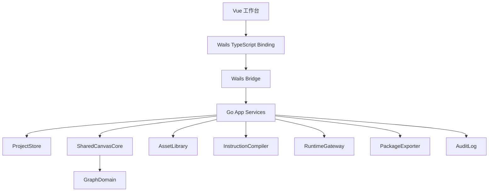

# 技术栈与实现分层

## 目标

本文登记图屿 Studio 当前产品落地技术栈，并把 Wails、Go 后端、Vue 3、TypeScript、Ant Design Vue 和 AntV 的职责边界细化为后续实现 issue 可以直接消费的技术约束。

技术选型服务于产品设计，不改变 `docs/design` 中已经固定的领域语义：图屿是 Canvas-first 私有 AI 视频创作 Studio，Project Canvas、Shared Canvas Core、本地项目存储、指令栈、ProviderMode、运行记录、交接包 fallback 和结果回收仍然是核心真相。

## 当前选型

| 层 | 当前选择 | 职责 |
| --- | --- | --- |
| 桌面壳与 bridge | Wails v2，预留 v3 迁移口 | 原生窗口、本地能力入口、Go 方法暴露、事件推送、应用打包 |
| 应用后端 | Go | 项目存储、领域服务、路径守卫、资产处理、任务运行、交接包、审计和恢复 |
| 前端框架 | Vue 3 + TypeScript | 工作台页面、组件、面板、状态呈现、调用 Go binding |
| 前端构建 | Vite | 开发服务、生产构建、Wails 前端资产构建 |
| UI 组件 | Ant Design Vue | 布局、菜单、表单、表格、抽屉、弹窗、通知、上传、进度和状态控件 |
| 图谱与图表 | AntV G6 / G2 | Project Canvas / Creative Graph 画布、关系图、生产状态和覆盖统计 |
| 项目存储 | 本地文件项目制 | `project.tuyu.json`、对象文件、资产、运行记录、审计、备份和交接包 |

## SDK 与依赖清单

### 前端 SDK

| 分层 | 依赖 / SDK | 阶段 | 用途 |
| --- | --- | --- | --- |
| Vue 核心 | `vue` | 必需 | 工作台 UI |
| 类型系统 | `typescript` | 必需 | 前端类型 |
| 构建 | `vite` | 必需 | dev/build 与 Wails 前端资产构建 |
| Vue 编译 | `@vitejs/plugin-vue` | 必需 | Vue SFC 编译 |
| 类型检查 | `vue-tsc` | 必需 | `.vue` 类型检查 |
| TS 配置 | `@vue/tsconfig` | 必需 | Vue TypeScript 基础配置 |
| Node 类型 | `@types/node` | 必需 | Vite、构建脚本和测试配置类型 |
| 路由 | `vue-router` | 必需 | Graph、Script、Asset、Run、Package、Review、Health 视图切换 |
| UI 状态 | `pinia` | 必需 | 当前项目、选择对象、面板折叠、运行队列和错误抽屉 |
| UI 组件 | `ant-design-vue` | 必需 | Layout、Menu、Tabs、Form、Table、Drawer、Modal、Upload、Progress、Alert、Tooltip、Notification |
| 图标 | `@ant-design/icons-vue` | 建议首批 | 工具栏、状态、按钮和空状态图标 |
| 图谱 | `@antv/g6` | 必需 | Project Canvas、节点、边、Frame、Blueprint、生产组、参考组和状态徽标 |
| 图表 | `@antv/g2` | 必需 | 生产状态、健康检查摘要和覆盖矩阵 |
| 工具 hooks | `@vueuse/core` | 建议首批 | 快捷键、窗口尺寸、debounce、local UI state |
| 日期时间 | `dayjs` | 建议首批 | 审计时间、运行耗时、最近保存时间 |
| 虚拟列表 | `vue-virtual-scroller` | 后续 | 大资产库、大运行记录列表 |
| 单元测试 | `vitest` | 建议首批 | store、组件和工具函数测试 |
| Vue 测试 | `@vue/test-utils` | 建议首批 | 组件测试 |
| DOM 测试环境 | `happy-dom` 或 `jsdom` | 建议首批 | Vitest DOM 环境 |
| E2E / smoke | `playwright` | 建议首批 | Web 原型和 Wails 前端 smoke |
| Lint | `eslint`、`typescript-eslint`、`eslint-plugin-vue` | 建议首批 | 前端质量门禁 |
| Format | `prettier` | 可选 | 格式统一 |

首个实现基线固定使用 Wails v2。Wails v2 通常使用生成目录 `wailsjs/go/...` 和 `wailsjs/runtime/...`；这些导入路径只允许出现在前端 API wrapper 中，不允许出现在页面和业务组件中。未来 Wails v3 稳定后，可以把 service 注册和 binding 导入替换到 wrapper / facade 层，DTO、Go service 和前端组件不应随之重写。

### Go 后端 SDK

| 分层 | 依赖 / SDK | 阶段 | 用途 |
| --- | --- | --- | --- |
| 桌面框架 | `github.com/wailsapp/wails/v2` | 必需 | 桌面壳、Go binding、事件、窗口和打包 |
| 并发 | `golang.org/x/sync/errgroup` | 建议首批 | 批量任务、健康检查和导出流程 |
| 请求合并 | `golang.org/x/sync/singleflight` | 建议首批 | 防重复索引、健康检查和运行状态刷新 |
| 文件监听 | `github.com/fsnotify/fsnotify` | 建议首批 | 项目目录、外部引用和资产变化 |
| ID | `github.com/oklog/ulid/v2` 或 `github.com/google/uuid` | 建议首批 | Project、Asset、Shot、Run、Package 稳定 ID |
| JSON Schema | `github.com/santhosh-tekuri/jsonschema/v6` | 建议首批 | manifest、输出契约和项目清单校验 |
| YAML | `gopkg.in/yaml.v3` | 可选 | provider profile 或 skill manifest |
| Markdown | `github.com/yuin/goldmark` | 可选 | skill、profile 和说明文档解析 |
| 图片处理 | `github.com/disintegration/imaging` | 建议首批 | 缩略图、尺寸读取和格式转换 |
| 图片扩展 | `golang.org/x/image` | 建议首批 | WebP、TIFF 等格式支持 |
| 系统密钥 | `github.com/99designs/keyring` 或 `github.com/zalando/go-keyring` | provider 阶段必需 | API key、token、refresh token，不进项目目录 |
| SQLite 缓存 | `modernc.org/sqlite` | 后续可选 | 搜索索引和缓存，不作为项目 truth |
| 测试断言 | `github.com/stretchr/testify` | 建议首批 | 单元测试断言 |
| 结构 diff | `github.com/google/go-cmp/cmp` | 建议首批 | DTO、schema、golden 比对 |

Go 标准库核心依赖包括 `context`、`os`、`io/fs`、`path/filepath`、`encoding/json`、`crypto/sha256`、`archive/zip`、`net/http`、`mime`、`image`、`text/template`、`log/slog` 和 `os/exec`。

### Provider / AI Adapter SDK

| 类型 | 阶段 | 策略 |
| --- | --- | --- |
| 手动交接 provider | 必需 | 不需要外部 SDK，生成本地 package、manifest、提示词和上传清单 |
| 文本 / 多模态 provider | 后续 | 优先用 Go `net/http` 自封装 adapter，避免核心绑定到单一 SDK |
| 图片生成 provider | 后续 | 按 capability 接 SDK 或 HTTP adapter；输出路径必须由图屿后端预分配 |
| 视频生成 provider | 后续 | 按 `apiSubmit` / `pollResult` capability 接 SDK 或 HTTP adapter |
| 本地 CLI runtime | 后续 | 用 Go `os/exec`，受 PathGuard、WritableRoots、NetworkAccess 控制 |
| 视频元数据 | 后续可选 | `ffmpeg` / `ffprobe` 作为外部二进制，必要时再加 Go wrapper |

### 不进入核心依赖

| 不引入 | 原因 |
| --- | --- |
| `axios` | 前端不应绕过 Wails binding 调后端 |
| Gin / Echo / Fiber | Wails 桌面应用不需要本地 HTTP server 作为主前后端接口 |
| 前端 AI SDK | 凭据和联网授权不能暴露到前端 |
| 前端文件系统 SDK | 本地路径必须走 Go PathGuard |
| SQLite 作为主存储 | 首个闭环坚持本地文件项目制，SQLite 只能做缓存或索引 |
| Electron | 当前方向是 Wails，不维护双桌面壳 |

## 分层职责



| 层 | 应该做 | 不应该做 |
| --- | --- | --- |
| Vue 工作台 | 展示、编辑、选择、预览、运行反馈、错误详情、键盘与面板交互 | 直接读写任意本机路径，绕过 Go 领域服务修改项目文件 |
| Wails Binding | 把前端命令收敛为类型化方法调用和事件订阅 | 承接领域规则、文件系统策略或 provider 判断 |
| Go App Services | 编排项目、图谱、资产、任务、导出、回收和审计 | 把 UI 组件状态当作领域真相 |
| 领域模块 | 维护对象、状态、校验、错误语义和恢复策略 | 依赖 Wails 窗口或 Vue 组件 |
| 本地项目存储 | 原子写、锁、迁移、备份、相对路径和健康检查 | 保存真实凭据或不可脱敏运行材料 |

### Wails v2 基线与 v3 迁移口

当前实现按 Wails v2 开发，但工程边界按 v3 的 service 思路设计：

- `go.mod` 固定 `github.com/wailsapp/wails/v2`。
- Wails v2 的 runtime、options、context 和事件 API 只允许出现在 `Wails App Facade` 或等价入口层。
- Go 领域 service 不 import Wails；前端页面和业务组件不 import `wailsjs/go/...`。
- 前端统一通过 `src/api/*` wrapper 调用 generated binding；未来迁移 v3 时优先只替换 wrapper 的 import 和 facade 注册方式。
- `ProjectDTO`、`GraphViewDTO`、`AppErrorDTO`、`RuntimeEventDTO` 等契约不依赖 Wails 类型。

核心原则是：运行时依赖锁 Wails v2，架构上不被 v2 的单 `App` binding 形态锁死。

### Go 后端架构约定

Go 后端分三层：

| 层 | 职责 | 禁止事项 |
| --- | --- | --- |
| Wails App Facade | 作为前端调用入口，做参数入口、service 调用、DTO 转换和事件发送 | 直接读写项目文件、判断 provider 能力、拼装交接包 |
| Application Services | 承接用户命令，编排 Project、Graph、Asset、Instruction、Runtime、Package、Result、Audit | 把 Wails context、Vue 状态或 provider SDK 类型向下传递为领域事实 |
| Domain / Infrastructure | 维护领域规则、状态机、路径、文件、keyring、HTTP、CLI、图片处理等外部能力 | 依赖 Wails 窗口或前端组件 |

`App` 可以在 Wails v2 中作为单一绑定入口，但方法命名必须按业务 service 表达，例如 `ProjectOpen`、`GraphApplyCommand`、`RuntimeStart`、`ProviderListProfiles`。禁止使用泛化 `DoAction`，也禁止按页面名定义后端方法。

## Go 后端模块建议

| 模块 | 职责 |
| --- | --- |
| `ProjectStore` | 创建、打开、保存、锁、schema 检测、迁移、备份和健康检查 |
| `PathGuard` | 项目内相对路径解析、用户选择文件授权、越界拒绝、可读写校验 |
| `SharedCanvasCore` | Studio Command、UI/CLI/Agent 入口归一、版本校验、CommandResult 和审计 |
| `GraphDomain` | Project Canvas 节点、边、ProductionFrame、ReferenceGroup、Blueprint、版本和一致性规则 |
| `AssetLibrary` | 导入、digest、去重、缩略图、绑定、缺失检测和恢复 |
| `InstructionCompiler` | 项目原则、上下文、能力包、模板和输出契约编译 |
| `RuntimeGateway` | 任务创建、队列、取消、超时、事件、错误映射和重试 |
| `PackageExporter` | manifest、引用文件、相对路径、上传清单和校验 |
| `ResultManager` | 结果导入、take、review 状态、修改任务和版本关系 |
| `AuditLog` | JSONL 事件写入、脱敏摘要、恢复线索和支持包材料 |
| `ProviderConfigService` | 全局 profile、项目引用、credentialRef、override 白名单和 keyring 状态 |

Wails 暴露的方法应优先调用这些 service，而不是把文件系统、图谱、运行时逻辑直接写在 Wails app struct 里。

## 前端模块建议

| 模块 | 技术选择 | 职责 |
| --- | --- | --- |
| View / Page | Vue Router + 页面容器 | 路由入口、页面布局、把用户动作转为明确 command |
| Feature Components | Vue SFC + composable | ProjectCanvas、AssetShelf、ShotInspector、RunQueue、ProviderSettings、PackageExportPanel 等局部交互 |
| Frontend API Wrapper | `src/api/*` | 包住 Wails generated binding，统一错误 DTO 规范化和 v2/v3 binding 隔离 |
| UI Session Store | Pinia 或等价轻量 store | 当前选择、面板折叠、过滤器、视口、运行队列投影、错误抽屉 |
| 控件体系 | Ant Design Vue | 表单、表格、抽屉、弹窗、通知、上传、进度、状态徽标和确认动作 |
| 图谱画布 | AntV G6 | 节点、边、Frame、Blueprint、生产组、参考组、状态徽标、框选、连线和布局 |
| 图表 | AntV G2 | 生产状态、模块覆盖、健康检查摘要和统计图 |

前端 store 只保存 UI 和会话态。项目、图谱、资产、运行记录和交接包的持久 truth 必须来自 Go service 返回的 DTO 和本地项目文件。页面和业务组件不直接 import Wails generated binding；组件可以调用 feature composable 或 API wrapper，但不能知道 `wailsjs/go/...` 的具体路径。

AntV G6 画布可以维护 layout、viewport、selection、hover、drag preview 和 temporary edge，但正式节点、边、生产组、Blueprint 和状态徽标来自 `ProjectCanvasDTO` / `GraphViewDTO`。画布交互产出 `CanvasCreateNodeCommand`、`CanvasMoveNodeCommand`、`CanvasConnectNodesCommand`、`CanvasInsertBlueprintCommand`、`CanvasDeleteNodeCommand` 等 Studio Command，后端确认后再刷新 DTO。

## 契约与 DTO 规则

Go 内部领域对象不应完整裸露给前端。Wails binding 暴露的请求、响应、错误和事件都必须走稳定 DTO。DTO 分四类：

| 类型 | 作用 | 示例 |
| --- | --- | --- |
| Command DTO | 表达用户动作、目标对象、确认状态、选项和幂等键 | `ProjectCreateCommand`、`GraphApplyCommand`、`RuntimeStartCommand`、`PackageExportCommand` |
| View DTO | 表达前端可展示投影、摘要、状态徽标和下一步动作 | `ProjectSummaryDTO`、`GraphViewDTO`、`AssetListItemDTO`、`RunQueueItemDTO` |
| Event DTO | 表达长任务、导出、迁移、健康检查和恢复过程 | `RuntimeEventDTO`、`PackageExportEventDTO`、`HealthCheckEventDTO` |
| Error DTO | 表达产品可预期错误、技术详情和恢复动作 | `AppErrorDTO` |

Command DTO 不接收内部领域对象。View DTO 可以为 UI 准备摘要字段，但不等于领域模型。Event DTO 外层字段保持统一：`eventId`、`runId`、`eventType`、`state`、`progress`、`targetType`、`targetId`、`summary`、`error`、`nextActions`、`createdAt`。

错误对象要能支撑三层展示：用户提示、技术详情和调试记录。前端不能从普通字符串里猜测错误类型。`AppErrorDTO` 至少包含：

```ts
interface AppErrorDTO {
  code: string
  severity: "info" | "warning" | "error" | "blocking"
  retryable: boolean
  targetType?: string
  targetId?: string
  userMessage: string
  technicalDetail?: string
  recoveryActions: string[]
  correlationId: string
}
```

领域或业务失败是 DTO，不是 JS exception。例如 `provider_credential_missing`、`path_traversal_rejected`、`package_reference_missing` 应返回结构化错误，由前端按 `code` 和 `recoveryActions` 渲染。Wails 调用失败、WebView 断连、panic 或未知异常才由前端 API wrapper 统一转换为 `transport_error` 或 `unexpected_error`。

## 任务运行与事件流

AI 任务、交接包导出、健康检查、迁移和批量资产处理都应采用事件化运行模型：

1. 前端提交命令。
2. Go service 创建运行记录或操作记录。
3. 后端通过 Wails event 推送 `queued`、`running`、`waiting_user`、`blocked`、`completed`、`failed`、`cancelled` 等状态。
4. 前端更新运行队列、节点徽标、Bottom Bar 和详情抽屉。
5. 后端把事件、输出、错误和审计写入项目目录。

阻塞式方法只用于短操作，例如读取列表、保存表单字段、打开详情、查询状态摘要。

后端是运行状态 truth，前端运行队列只是事件投影。前端不能伪造正式 running 状态；页面刷新或 WebView 重连后，必须通过 `RuntimeListRuns`、`ProjectOpen` 或等价查询从 run record 恢复。事件必须带 `eventId` 或可去重序号，前端收到重复事件要幂等。取消和重试都由后端裁决：取消失败返回错误 DTO；重试创建新 run，不覆盖旧 run 或旧产物。

## 文件存储策略

首个生产闭环应坚持本地文件项目制：

- `project.tuyu.json` 是项目核心清单和图谱分区真相。
- 角色、场景、道具、镜头、提示词、运行记录、资产、包和审计按目录组织。
- `ProjectStore` 是项目目录正式文件的唯一写入口；其他模块只能提交 patch、draft 或 command。
- `PathGuard` 是所有本机路径的前置门禁，负责真实路径解析、项目根检查、符号链接逃逸检查、授权范围和相对路径转换。
- 写入使用校验、临时文件、fsync、rename 和审计事件。
- `AuditLog` 是产品证据，不是普通程序日志；它记录用户动作、状态变更、导入导出摘要、provider handoff/attempt、错误和恢复动作。
- 项目内引用使用相对路径。
- SQLite 或嵌入式索引可以作为后续缓存优化，但不应在首个闭环替代项目目录 truth。
- `fsnotify` 只触发 dirty/stale 标记、健康检查和用户提示，不直接自动修复项目 truth。

如果审计写入失败，普通保存可以进入降级状态；危险操作、恢复动作、外部导出和锁接管必须阻断，避免不可追溯的项目变化。

## Web 原型关系

当前设计 Web 原型位于：

`/Users/suqing/Coding/design/tuyu-design`

该仓库是 Vite + Vue 3 + TypeScript 原型，用于评审设计内容和图谱/图表示意。它不是最终 Wails 应用，不负责 Go 后端、Wails bridge、文件写入、AI 任务或发布打包。原型中有价值的页面结构、数据对象、AntV 示例和中文化处理可以迁移为前端实现参考，但不得把原型仓作为产品数据真相。

## 早期实现顺序

1. Wails 骨架、Go service 分层、Vue App Shell 和基础 binding。
2. 本地项目创建、打开、保存、锁和健康检查。
3. Project Canvas 基础画布、Inspector、Blueprint、自动保存和版本冲突。
4. 资产导入、digest、缩略图、绑定和缺失修复。
5. 剧本、场次、ShotCard 和字段校验。
6. 指令栈预览、Blueprint、Agent Skill/CLI、输出契约和风险提示。
7. ProviderMode 任务运行、事件流、PromptRun、错误语义和重试。
8. 交接包 fallback 导出、结果回收、review 和审计。

## 风险与验证重点

| 风险 | 验证要求 |
| --- | --- |
| Wails v2 细节泄漏 | Go service 不 import Wails，前端页面和组件不 import `wailsjs/go/...` |
| Wails WebView 跨平台差异 | macOS、Windows、Linux 至少跑 App Shell、画布、文件选择、快捷键、拖拽 smoke |
| 画布性能和交互复杂度 | 大图谱、框选、连线、生产组、参考组、历史轨和节点状态需要专项验证 |
| Go/TS 契约漂移 | binding 生成后执行 TypeScript 类型检查和 Go 单元测试 |
| 文件写入损坏 | ProjectStore 单元测试覆盖原子写、锁、备份、迁移和回滚 |
| 路径越界 | PathGuard 单元测试覆盖 `..`、符号链接、绝对路径、URL 伪装和外部导出确认 |
| 任务黑盒化 | RuntimeGateway 测试覆盖事件、取消、超时、失败、重试和错误 DTO |
| UI 控件密度 | Ant Design Vue 组件需要在窄屏、长文本、长项目名和长错误详情下验证不溢出 |

## 验收标准

- 技术栈文档能直接映射到后续 issue 的 Scope、Implementation Scope 和 Verification Commands。
- 首个实现基线使用 Wails v2，同时通过 facade、API wrapper 和独立 DTO 保留 v3 迁移口。
- Wails 只作为 bridge 和桌面壳，不承接领域规则。
- Go service 可以在不启动 Wails 的情况下单元测试。
- 前端通过 API wrapper、类型化 binding 和 DTO 调用后端，不直接读写本地项目文件。
- Ant Design Vue 和 AntV 的职责边界清晰：控件归 Ant Design Vue，图谱和图表归 AntV。
- 本地项目文件仍然是首个生产闭环的数据 truth。
