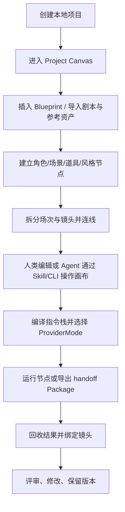

# 00. 产品边界与术语

## 子文档

| 文档 | 作用 |
| --- | --- |
| `product-boundary.md` | Canvas-first 产品定位、目标用户、做什么、不做什么、画布闭环边界 |
| `user-workflows.md` | 人、Agent 与混合协作从 Project Canvas 到结果 review 的主路径和异常路径 |
| `glossary.md` | 统一术语、对象名、状态词、文档内中英文用法 |

说明：本 README 只作为模块概览；产品边界、用户路径和术语规范以对应子文档为准。

## 产品定义

图屿是一个 Canvas-first 私有 AI 视频创作 Studio。它帮助创作者把剧本、角色、场景、道具、参考图、分镜、提示词、生成任务、交接包和外部结果组织在同一个 Project Canvas 中，并把人类直接编辑、Agent Skill/CLI 操作和每次 AI 辅助处理都变成可检查、可复用、可恢复的生产记录。

一句话定义：

```text
图屿用本地 Project Canvas 管理 AI 视频创作资产，让人和 Agent 在同一张无限画布上编排、运行、回收和评审。
```

## 核心目标

| 目标 | 生产含义 | 验收信号 |
| --- | --- | --- |
| 本地资产闭环 | 项目、画布、素材、提示词、运行记录、生成包、结果文件都能在本地目录中自洽存在 | 复制项目目录到另一台机器后可打开并校验缺失项 |
| 画布关系可视化 | 剧本、角色、场景、道具、镜头、提示词、生成任务、交接包和结果之间有明确节点、边和 Frame | 用户能从任意结果追溯到镜头、参考图、运行记录和来源命令 |
| 人机共创一致 | 人类 UI 与外部 Agent 都通过 Studio Command 修改同一 Project Canvas | Agent 创建、移动、连线和运行节点时，UI 能即时显示且可审计 |
| 指令编排可控 | 项目原则、风格、角色连续性、任务模板和输出契约按固定顺序编译 | 调用前可预览编译结果，冲突规则会阻断任务 |
| 生成交接可复查 | 每个镜头或场次可直接运行，也可导出结构化交接包作为 handoff/fallback | 交接包可离线检查，manifest 与引用文件一致 |
| 结果回收可管理 | 外部生成结果回到本地后能绑定、对比、评审和重做 | 同一镜头可保留多个 take 和 review 记录 |

## 明确不做

| 不做 | 说明 |
| --- | --- |
| 云端协作平台 | 当前设计不包含账号、团队权限、实时多人编辑、云同步 |
| 专业剪辑软件 | 不实现复杂时间线、音轨混音、成片渲染、调色和字幕工程 |
| 外部平台自动代理 | 默认不替用户后台提交外部平台任务，也不静默上传完整项目 |
| 通用文件管理器 | 只管理图屿项目内或用户显式导入的创作资产 |
| 黑盒 AI 代理 | AI 任务必须有输入、输出契约、运行记录、错误语义和用户可见状态 |
| 真实扣费 / 积分系统 | 当前只保留成本与积分占位，不实现余额、账单、扣费、充值和会员体系 |

## 目标用户

| 用户 | 核心任务 | 图屿提供的能力 |
| --- | --- | --- |
| 个人 AI 视频创作者 | 从想法、剧本和参考图整理镜头生成材料 | 本地项目、Project Canvas、分镜、提示词优化、运行、结果绑定 |
| 短剧 / 漫剧创作者 | 管理角色一致性、场景连续性和批量镜头 | 角色圣经、场景规则、镜头状态、画布 Blueprint |
| 广告 / 产品视频创作者 | 维持品牌、产品外观和脚本卖点一致 | 项目原则、产品道具卡、参考图锁定、review 记录 |
| 开发者型创作者 | 自定义能力包、模板、provider profile 和 Agent Skill | 受控能力包目录、指令栈预览、Studio Command、适配器抽象 |

## 主工作流



主工作流必须支持中断恢复。用户在任何阶段关闭应用后，再次打开项目时应能看到上一次保存的画布视口、图谱、节点状态、运行记录、Agent 操作和未完成任务结论。

## 术语表

| 术语 | 定义 |
| --- | --- |
| Studio Root | 图屿本地数据根，包含全局配置、能力包和项目列表 |
| Project | 一个创作项目的持久化根，包含画布、图谱、资产、规则、运行记录和交接产物 |
| Project Canvas | 项目的第一工作台，保存无限画布视口、节点、边、Frame、Blueprint、运行状态和结果评审入口 |
| Shared Canvas Core | UI 与 Agent 共同调用的项目状态机和命令校验边界 |
| Studio Command | UI、CLI、MCP 风格入口修改项目的唯一命令边界 |
| Creative Graph | Project Canvas 内用节点和边表示创作资产、上下文、任务和结果关系的结构化关系层 |
| Node | 画布上的可视化对象，通常通过 `refId` 指向领域对象 |
| Edge | 节点之间的关系，如使用、生成、优化、打包、结果归属 |
| Asset | 被导入或生成的图片、视频、音频、文本、交接包文件 |
| Continuity | 人物、场景、道具、风格在多个镜头之间保持一致的规则与证据 |
| Bible | 对角色、场景、风格或世界观的稳定描述和锁定规则 |
| Shot | 一个可生产的镜头单位，包含画面、动作、运镜、时长、对白和状态 |
| Prompt | 面向 AI 任务的提示词对象，可包含原始描述、优化结果和负面约束 |
| Instruction Stack | 一次 AI 任务前把规则、上下文、能力包、模板和输出契约组装起来的编译结果 |
| Skill / 能力包 | 可复用的任务说明、输出格式和参考资料集合 |
| Canvas Blueprint | 可插入画布的一组节点、边、Frame、输入槽、输出契约和恢复语义 |
| ProviderMode | 运行来源模式，当前为 internal_provider 或 external_agent |
| External Agent | 通过 Skill/CLI/MCP 风格接口操作 Project Canvas 的外部 Agent |
| Provider Profile | 面向某类外部生成目标的提示词格式、交接规则和能力声明 |
| Prompt Run | 一次 AI 任务运行记录，保存输入摘要、编译指令、输出、错误和产物 |
| Generation Package | 一个镜头或场次的生成交接包，包含 manifest、提示词、剧本片段、参考图和清单 |
| Take | 同一镜头的一次外部生成结果版本 |
| Review Status | 用户对结果的评审状态，如待看、通过、需修改、废弃 |

## 产品级验收

| 验收项 | 标准 |
| --- | --- |
| 创建项目 | 可以创建、打开、关闭、重新打开本地项目，项目结构完整 |
| 导入资产 | 图片和视频导入后有预览、来源、digest、角色/场景/道具绑定 |
| 建图 | 用户能创建核心节点、Frame 和 Blueprint，并用边表达使用、生成、打包、结果归属 |
| Agent 操作 | 外部 Agent 能通过受控命令创建、移动、连线、运行和写回节点，所有操作在 UI 可见 |
| 编译 | 用户能预览指令栈，看到上下文来源和输出契约 |
| 运行 | AI 任务有 ProviderMode、排队、运行、完成、失败、取消状态和运行记录 |
| 导出 | 交接包包含 manifest、提示词、剧本片段、连续性说明、参考图、上传清单，并明确是 handoff/fallback |
| 回收 | 用户能拖入结果文件并绑定到镜头或交接包，保留多个 take |
| 审计 | 任意产物能追溯到源节点、源资产、任务运行和用户操作 |
