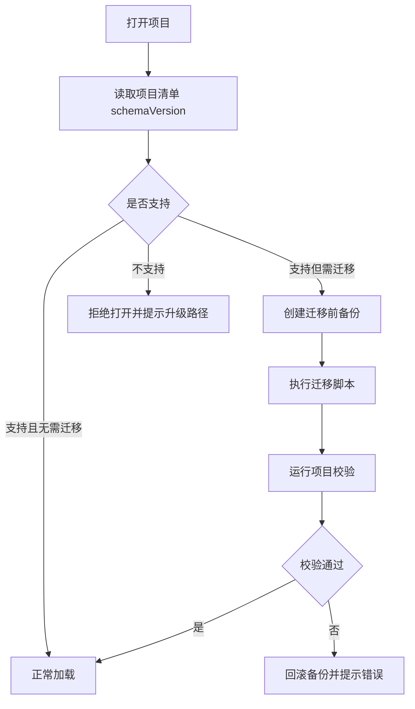

# 01. 本地项目存储设计

## 子文档

| 文档 | 作用 |
| --- | --- |
| `directory-layout.md` | Studio root、project root、资产、包、运行记录、审计目录 |
| `schema-and-migration.md` | 单一项目清单、schema version、迁移、备份和回滚 |
| `save-lock-recovery.md` | 原子写、自动保存、项目锁、崩溃恢复 |
| `health-check.md` | 缺文件、断链、digest、外部引用、迁移风险检查 |

说明：本 README 只作为模块概览；canonical schema、状态和错误语义以对应子文档为准。

## 目标

本地项目存储是图屿的执行真相。它必须保证项目能长期打开、迁移、校验、恢复，并且在写入失败、应用崩溃、磁盘异常或 schema 升级时尽量保护用户资产。

## 目录结构

```text
{studio_root}/
├─ config/
│  ├─ app_settings.json
│  ├─ studio_profile.md
│  └─ provider_profiles/
├─ skills/
│  └─ {skill_name}/
└─ projects/
   └─ {project_id}/
      ├─ project.tuyu.json
      ├─ characters/
      ├─ scenes/
      ├─ props/
      ├─ shots/
      ├─ prompts/
      │  ├─ prompt_index.json
      │  └─ runs/
      ├─ assets/
      │  ├─ inputs/
      │  ├─ refs/
      │  ├─ outputs/
      │  ├─ results/
      │  └─ thumbnails/
      ├─ packages/
      ├─ audit/
      ├─ backups/
      └─ locks/
```

| 路径 | 内容 | 写入方式 |
| --- | --- | --- |
| `project.tuyu.json` | 项目元信息、schema 版本、默认配置、图谱分区、项目原则、风格设定、索引和最近状态 | 单一清单原子写，内部带分区版本 |
| `characters/` | 角色 profile、视觉规则、参考图绑定 | 单对象文件 |
| `scenes/` | 场景 profile、地点、氛围、光线、参考图 | 单对象文件 |
| `props/` | 道具或产品对象、外观规则、用途 | 单对象文件 |
| `shots/` | 镜头卡、状态、关联对象、评审记录 | 单对象文件 |
| `prompts/` | 提示词对象、任务运行记录 | append + 索引 |
| `assets/` | 导入、参考、生成、结果和缩略图 | 文件复制或受控引用 |
| `packages/` | 生成交接包 | 重新导出时创建新版本目录 |
| `audit/` | 操作日志、任务摘要、恢复动作 | append-only JSONL |
| `backups/` | 自动备份和迁移前快照 | 轮转保留 |
| `locks/` | 项目打开锁和写入锁 | 短生命周期 |

用户体验口径：项目根只暴露 `project.tuyu.json` 这一份核心项目清单。角色、场景、镜头等单对象文件是内部存储细节，工作台应通过对象列表、图谱和检查器呈现，不要求非专业用户理解或手动管理多份元数据文件。ProductionFrame、ReferenceGroup、输出节点布局和历史摘要优先保存在 `project.tuyu.json.graph` 分区；完整 FrameRun 详情复用现有 prompts/runs、adapter attempt、assets outputs 和 audit 记录体系，不新增给用户管理的核心元数据文件。

## project.tuyu.json

```json
{
  "schemaVersion": "1.0.0",
  "project": {
    "id": "proj_20260514_001",
    "name": "demo",
    "type": "series",
    "createdAt": "2026-05-14T10:00:00+08:00",
    "updatedAt": "2026-05-14T10:20:00+08:00"
  },
  "paths": {
    "root": ".",
    "assets": "assets",
    "packages": "packages"
  },
  "defaults": {
    "providerProfileId": "provider_manual_handoff",
    "language": "zh",
    "aspectRatio": "9:16"
  },
  "integrity": {
    "lastCleanShutdown": true,
    "lastGraphVersion": 42
  },
  "graph": {
    "version": 42,
    "nodes": [],
    "edges": [],
    "viewport": {
      "x": 0,
      "y": 0,
      "zoom": 1
    }
  },
  "principles": {
    "summary": "",
    "lockedRules": []
  },
  "styleBible": {
    "summary": "",
    "visualRules": []
  }
}
```

字段约束：

- `schemaVersion` 用于迁移，不等于应用版本。
- `paths` 必须使用项目内相对路径。
- `defaults` 只保存非敏感偏好，不保存凭据。
- `integrity.lastCleanShutdown=false` 时，打开项目要触发恢复检查。

## 保存策略

### 原子写

所有结构化数据文件写入使用临时文件加 rename：

```text
1. 写入 {file}.tmp
2. fsync tmp
3. rename tmp -> file
4. fsync parent dir
5. 写 audit 事件
```

如果 rename 失败，保留旧文件，显示写入错误，并把临时文件路径写入恢复提示。

### 自动保存

| 数据 | 触发 | 节流 | 失败处理 |
| --- | --- | --- | --- |
| project manifest.graph | 节点移动、连线、删除、布局变化 | 500-1000ms | 保留前一版本，提示重试 |
| 领域对象 | 表单保存、失焦、显式保存 | 即时 | 表单保留未保存状态 |
| 资产索引 | 导入、生成、删除绑定 | 即时 | 标记资产 pending，允许重新索引 |
| 运行记录 | 任务开始、事件、完成、失败 | append | 失败时写入 fallback error 文件 |

### 项目锁

打开项目时创建 `locks/session.lock`：

```json
{
  "appInstanceId": "local_instance_001",
  "openedAt": "2026-05-14T10:00:00+08:00",
  "pid": 12345,
  "host": "local-machine"
}
```

如果发现现有锁：

- 同进程重入：允许。
- 进程已不存在：提示用户恢复并接管。
- 进程仍存在：默认只读打开，用户确认后才接管。

## 资产路径策略

资产支持两种进入方式：

| 模式 | 说明 | 适用 |
| --- | --- | --- |
| copy | 将源文件复制到项目内，生成 digest 和 metadata | 默认导入模式 |
| managed reference | 保留外部路径引用，同时记录 digest、权限和缺失风险 | 用户明确选择，适合超大文件 |

生产默认使用 copy。managed reference 必须在项目健康检查里列为可迁移风险。

## schema 迁移

迁移流程：



迁移要求：

- 迁移前必须写 `backups/pre_migration_{timestamp}/`。
- 迁移脚本必须幂等，重复运行不会重复创建对象。
- 每次迁移写入 `audit/migrations.jsonl`。
- 迁移失败不覆盖原项目。

## 健康检查

项目打开和导出前必须支持健康检查：

| 检查项 | 错误级别 | 修复方式 |
| --- | --- | --- |
| `project.tuyu.json` 缺失或 JSON 无效 | blocking | 从备份恢复或拒绝打开 |
| `project.tuyu.json.graph` 无效 | blocking | 尝试加载最近项目清单备份 |
| 节点 `refId` 指向缺失对象 | warning/blocking | 提供断链列表和清理建议 |
| asset 文件缺失 | warning | 标记缺失，允许重新定位 |
| digest 不匹配 | blocking | 防止错误素材被静默使用 |
| 交接包引用文件缺失 | warning | 允许重新导出 |
| 非相对路径进入 manifest | blocking | 拒绝导出 |

## 失败语义

| 失败 | 用户提示 | 系统行为 |
| --- | --- | --- |
| 磁盘空间不足 | 保存失败，磁盘空间不足，请释放空间后重试 | 停止写入，保留旧文件 |
| 权限不足 | 当前项目目录不可写 | 切换只读模式，提示另存 |
| 路径越界 | 文件路径不在项目目录或允许列表内 | 拒绝操作并写安全日志 |
| JSON 损坏 | 项目文件损坏，正在查找备份 | 尝试最近备份，保留损坏文件副本 |
| 资产缺失 | 部分资产找不到，相关节点会显示缺失状态 | 不删除绑定，等待用户重新定位 |
| 并发打开 | 项目可能已被另一个实例打开 | 默认只读，用户确认接管 |

## 验收标准

- 创建项目后目录结构完整，`project.tuyu.json` 可解析，且项目元信息、图谱、原则和风格设定分区存在。
- 连续移动节点、关闭应用、重新打开后布局和对象状态一致。
- 写入中断后仍可打开上一版可用项目。
- 导入同一图片两次能识别 digest，避免重复或提示复用。
- 将项目目录复制到另一位置后，相对路径资产和交接包仍可校验。
- 人为删除一个资产文件后，项目健康检查能指出具体影响节点。
- schema 升级失败时能回滚到升级前备份。
