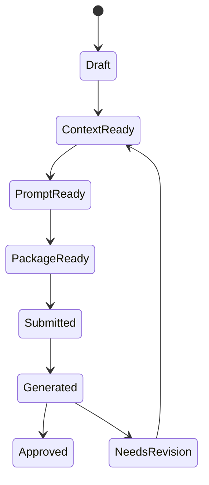

# 02. Project Canvas / Creative Graph 领域模型

## 子文档

| 文档 | 作用 |
| --- | --- |
| `nodes-and-edges.md` | Project Canvas、节点、边、Frame、Blueprint、关系约束、GraphNode 与领域对象边界 |
| `graph-state-machine.md` | Shot、PromptRun、Package、Result 的状态推进 |
| `context-resolution.md` | 选中节点如何展开上下文、裁剪、摘要和冲突 |
| `consistency-rules.md` | 删除、修改、断链、dirty 标记和级联规则 |

说明：本 README 只作为模块概览；canonical schema、状态和关系约束以对应子文档为准。

## 目标

Project Canvas 是图屿的主工作区，Creative Graph 是其结构化关系层。它不是普通图片白板，也不是专业剪辑时间线，而是人类创作者和外部 Agent 对影视前期资产、AI 任务和结果关系的共同可视化图谱。领域模型必须同时服务创作表达、数据一致性、任务编排、Agent 可见操作和结果追溯。

## GraphDocument

```ts
type GraphNodeKind =
  | "script"
  | "scene"
  | "character"
  | "prop"
  | "style"
  | "shot"
  | "prompt"
  | "fusion"
  | "package"
  | "video_result"
  | "note"

type GraphEdgeRelation =
  | "uses"
  | "belongs_to"
  | "generated_by"
  | "refines"
  | "packaged_as"
  | "result_of"
  | "depends_on"

type CanvasNodeCategory =
  | "source"
  | "concept"
  | "continuity"
  | "production"
  | "output"
  | "review"
  | "organizer"
  | "handoff"

type NodeSource = "human" | "agent" | "system" | "imported"

interface ProjectCanvas {
  id: string
  projectId: string
  schemaVersion: string
  version: number
  viewport: {
    x: number
    y: number
    zoom: number
  }
  theme: "dark" | "warm_light"
  grid: {
    visible: boolean
    size: number
    opacity: number
  }
  nodes: GraphNode[]
  edges: GraphEdge[]
  frames: ProductionFrame[]
  referenceGroups: ReferenceGroup[]
  blueprintInstances: CanvasBlueprintInstance[]
  selectedNodeIds: string[]
  updatedAt: string
}

interface GraphDocument {
  id: string
  projectId: string
  schemaVersion: string
  version: number
  viewport: {
    x: number
    y: number
    zoom: number
  }
  nodes: GraphNode[]
  edges: GraphEdge[]
  updatedAt: string
}

interface GraphNode {
  id: string
  kind: GraphNodeKind
  category: CanvasNodeCategory
  title: string
  refId?: string
  x: number
  y: number
  width: number
  height: number
  collapsed?: boolean
  status?: string
  badges?: string[]
  source: NodeSource
  sourceEventId?: string
  data?: Record<string, unknown>
}

interface GraphEdge {
  id: string
  sourceNodeId: string
  targetNodeId: string
  relation: GraphEdgeRelation
  label?: string
  createdAt: string
}

type ProviderCapability =
  | "text_understanding"
  | "image_understanding"
  | "video_understanding"
  | "image_generation"
  | "video_generation"
  | "api_submit"
  | "poll_result"

interface ReferenceGroup {
  id: string
  title: string
  role: "motion_reference" | "identity_reference" | "scene_reference" | "style_reference" | "manual_context"
  inputNodeIds: string[]
  priority: number
  notes?: string
}

interface ProductionFrame {
  id: string
  title: string
  referenceGroupIds: string[]
  outputNodeIds: string[]
  taskIntent: string
  requiredCapabilities: ProviderCapability[]
  historySummary: FrameRunSummary
  x: number
  y: number
  width: number
  height: number
  collapsed?: boolean
}

interface CanvasBlueprintInstance {
  id: string
  blueprintId: string
  title: string
  frameIds: string[]
  nodeIds: string[]
  edgeIds: string[]
  insertedBy: NodeSource
  insertedAt: string
}

interface FrameRunSummary {
  currentRunId?: string
  favoriteRunIds: string[]
  latestSuccessfulRunId?: string
}
```

核心约束：

- `ProjectCanvas` 是保存单元；旧文档中的 `GraphDocument` 可视为 ProjectCanvas 的关系子集。
- `GraphNode.id` 是画布对象 ID，`refId` 是领域对象 ID。
- `GraphNode.source` 记录人类、Agent、系统或导入来源，必须能追溯到 audit event。
- `ReferenceGroup` 是内层输入组，只保存输入节点引用、引用角色和用户说明，不拥有输出历史。
- `ProductionFrame` 是外层可运行生产组，保存参考组、输出节点、任务意图、所需 provider 能力和历史摘要。
- `FrameRunSummary` 只用于画布历史轨，完整运行历史仍在 PromptRun、adapter attempt、Asset 和 audit 等运行记录中。
- 领域对象的完整数据不放在 `data` 中，`data` 只放少量 UI 缓存和展示摘要。
- 删除领域对象时必须处理关联节点；删除节点不默认删除领域对象。
- `GraphDocument.version` 每次保存自增，用于冲突检测和恢复。

## 节点类型

| 类别 | 用途 | 典型节点 |
| --- | --- | --- |
| `source` | 输入资料和剧本来源 | script、note、imported asset |
| `concept` | 设定和世界观 | style、scene |
| `continuity` | 连续性锁定对象 | character、prop、scene |
| `production` | 可运行生产单元 | shot、prompt、fusion |
| `output` | 运行输出或外部回收结果 | video_result、asset |
| `review` | 评审状态和修改结论 | take、review note |
| `organizer` | Frame、分组、看板组织 | frame、reference group |
| `handoff` | 离线或手工交接兜底 | package |

| 节点 | 领域对象 | 核心内容 | 生产要求 |
| --- | --- | --- | --- |
| ScriptNode | ScriptDocument | 剧本文本、场次、对白、旁白 | 支持长文本编辑、拆场次、引用镜头 |
| SceneNode | SceneProfile | 地点、时间、氛围、光线、参考图 | 支持连续性规则和缺失资产提示 |
| CharacterNode | CharacterProfile | 身份、外观、服装、表情、禁改项 | 支持锁定规则和多参考图 |
| PropNode | PropProfile | 道具、产品、关键物件 | 支持外观规则、出现镜头、引用图 |
| StyleNode | StyleProfile | 色彩、镜头语言、美术原则 | 可被项目或场次引用 |
| ShotNode | ShotCard | 时长、景别、动作、运镜、台词、状态 | 是交接包和结果绑定的最小单位 |
| PromptNode | PromptObject | 原始提示词、优化提示词、负面约束 | 必须关联运行记录或手动来源 |
| FusionNode | FusionTask | 多素材融合任务、输出说明、参考图 | 记录输入资产和输出产物 |
| PackageNode | GenerationPackage | 交接包 manifest、路径、状态 | 引用镜头和资产，不反向覆盖源对象 |
| VideoResultNode | VideoResult | 结果文件、take、评审状态 | 支持多版本和回退 |
| NoteNode | NoteObject | 用户备注、灵感、待办 | 作为创作数据，不进入指令高优先级 |

## 双层生产组

画布上的组分为两层：

- 内层 `ReferenceGroup`：组织视频、图片、文本、角色、场景等输入引用。它可以折叠、移动、复用，也可以带有用户说明；说明进入指令栈时必须作为 data 包装。
- 外层 `ProductionFrame`：代表用户眼中的一次生产意图，包含一个或多个 `ReferenceGroup`、输出节点、任务意图、所需 provider capability 和历史摘要。选择外层组时打开任务抽屉；选择内层组时查看和编辑输入引用。
- 输出节点属于外层 `ProductionFrame`，不属于内层参考组。输出可以是文本、图片或视频，实际可用性由 provider capability 决定。
- 历史轨贴在外层生产组的输出侧，只展示当前版本、收藏版本和最近成功版本。失败、取消、草稿进入完整运行历史，不挤在画布缩略轨中。

`ProductionFrame` 和 `ReferenceGroup` 是 GraphDocument 的画布生产上下文，不替代 `ShotCard`、`PromptObject`、`Asset`、`GenerationPackage` 或 `VideoResult`。从 Frame 发起运行时创建新的运行记录；`FrameRun` 是用户可理解的历史入口，可引用 `PromptRun`、provider attempt 和输出 Asset，但不建成 GraphNode 或 GraphEdge 端点。

## 边语义

| 关系 | 方向 | 示例 | 校验 |
| --- | --- | --- | --- |
| `uses` | 使用方 -> 被使用方 | Shot uses Character | target 必须是可引用资产或设定 |
| `belongs_to` | 子对象 -> 父对象 | Shot belongs_to Scene | parent 删除时要提示影响范围 |
| `generated_by` | 产物 -> 图谱支持的源节点 | Prompt generated_by Fusion | 运行来源写入领域对象字段或 run records，不通过 GraphEdge 表达 |
| `refines` | 新版本 -> 旧版本 | Prompt B refines Prompt A | 防止循环引用 |
| `packaged_as` | Shot -> Package | Shot packaged_as Package | Package 必须包含 manifest |
| `result_of` | Result -> Shot/Package | Result result_of Package | Result 文件必须存在 |
| `depends_on` | 任务 -> 上下文 | Fusion depends_on Character | 上下文缺失时任务不可重跑 |

## 状态模型

### Shot 状态



| 状态 | 含义 | 进入条件 |
| --- | --- | --- |
| `draft` | 镜头草稿 | 用户创建 ShotNode |
| `context_ready` | 角色、场景、道具、剧本片段足够 | 必填字段和引用检查通过 |
| `prompt_ready` | 已生成或确认镜头提示词 | PromptNode 或 PromptObject 可用 |
| `package_ready` | 已导出交接包 | Package manifest 校验通过 |
| `submitted` | 用户标记已交接外部平台 | 手动操作记录 |
| `generated` | 已回收结果 | VideoResult 绑定成功 |
| `approved` | 结果验收通过 | 用户 review 通过 |
| `needs_revision` | 结果需要修改 | 用户 review 退回并记录原因 |

### PromptRun 状态

| 状态 | 含义 | 保留信息 |
| --- | --- | --- |
| `queued` | 等待运行 | 请求摘要、排队时间 |
| `running` | 运行中 | 事件流、开始时间 |
| `waiting_user` | 等待用户确认或补充 | 阻塞原因 |
| `completed` | 完成 | 输出、产物路径、耗时 |
| `failed` | 失败 | 错误类型、用户提示、可重试性 |
| `cancelled` | 用户取消 | 取消时间、已产生的临时产物 |

## 一致性规则

| 场景 | 规则 |
| --- | --- |
| 创建边 | 必须校验 source/target 存在且关系类型允许 |
| 删除节点 | 默认只删除画布节点；如有关联领域对象，提示用户选择保留或删除 |
| 删除领域对象 | 先列出关联节点和边，用户确认后级联清理或转为断链占位 |
| 移动/缩放节点 | 只更新 `project.tuyu.json.graph` 图谱分区，不触碰领域对象文件 |
| 修改 Shot 字段 | 更新 `shots/{id}.json`，再刷新节点摘要 |
| 修改角色连续性 | 标记引用该角色的 Shot 为 `context_dirty` |
| 重新导出 Package | 生成新版本目录，不覆盖旧 PackageNode 的审计记录 |
| 移动 ProductionFrame | 更新 `project.tuyu.json.graph` 图谱分区中的 frame 布局，不触碰领域对象 |
| 修改 ReferenceGroup 输入 | 重算相关 Frame 的上下文摘要；已存在 FrameRun 保留运行时输入快照 |

## 图谱操作

| 操作 | 输入 | 输出 | 错误 |
| --- | --- | --- | --- |
| CreateNode | `kind`、`title`、`position`、可选 `refId` | GraphNode | kind 不支持、refId 不存在 |
| CreateDomainNode | `kind`、领域对象初始值 | 领域对象 + GraphNode | 字段校验失败 |
| ConnectNodes | source、target、relation | GraphEdge | 关系不允许、循环、重复边 |
| UpdateNodeLayout | nodeId、位置、尺寸 | graph version+1 | node 缺失、版本冲突 |
| ResolveContext | selectedNodeIds | 上下文包 | 必需引用缺失 |
| DeleteNode | nodeId、deleteDomain? | 删除结果 | 有阻塞依赖未确认 |

## 上下文解析

选中节点发起任务时，后端按以下顺序解析上下文：

1. 读取选中节点和直接相邻边。
2. 根据节点类型展开领域对象。
3. 收集 Shot 所属 Scene、使用的 Character、Prop、Style。
4. 收集绑定资产、digest、相对路径和说明。
5. 收集相关 Prompt、PromptRun 和 Package 历史。
6. 生成 `ContextBundle`，只包含任务所需字段。
7. 将用户备注和剧本文本标记为 data，不能提升为系统规则。

## 验收标准

- 可创建所有核心节点并保存布局。
- 可创建合法边并拒绝非法边或循环。
- 删除节点不会误删领域对象，删除领域对象会列出影响范围。
- 修改角色连续性后，关联镜头能显示上下文已变更。
- 从 VideoResultNode 能追溯到 Package、Shot、PromptRun、角色和资产。
- ProductionFrame 能显示内层 ReferenceGroup、输出节点和历史轨，且缺 provider 能力时只降级任务入口。
- 人为制造断链后，项目健康检查能定位断链节点和关系。
