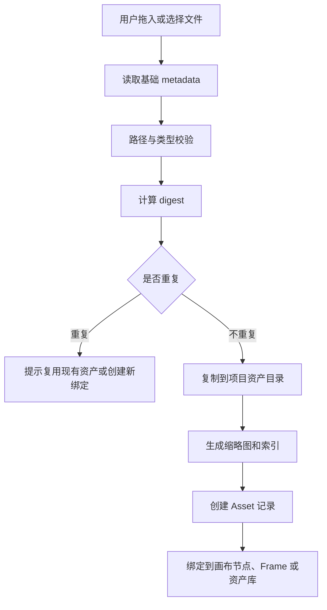

# 03. 资产库与连续性治理

## 子文档

| 文档 | 作用 |
| --- | --- |
| `asset-ingestion-and-indexing.md` | 导入、digest、缩略图、重复检测、managed reference |
| `asset-binding-and-lineage.md` | 资产绑定、来源追溯、PromptRun 和 Package 关联 |
| `continuity-rules.md` | 角色、场景、道具、风格连续性和冲突输出 |
| `deletion-and-recovery.md` | 解绑、回收区、恢复、永久清理和影响分析 |

本 README 只作为模块概览；详细规则、字段、状态和验收口径以子文档为准。

## 目标

资产库负责管理图屿项目中的图片、视频、音频、文本、生成包、缩略图和画布节点绑定。连续性治理负责让角色、场景、道具、风格在多个镜头之间稳定复用，并在用户、AI 任务或外部 Agent 试图改变锁定规则时给出明确冲突。

## 资产对象

```ts
type AssetType = "image" | "video" | "audio" | "text" | "package" | "thumbnail"

type AssetRole =
  | "character_ref"
  | "character_expression"
  | "character_pose"
  | "scene_ref"
  | "prop_ref"
  | "style_ref"
  | "storyboard"
  | "generated_ref"
  | "video_result"
  | "script_source"
  | "package_file"
  | "other"

interface Asset {
  id: string
  projectId: string
  type: AssetType
  role: AssetRole
  relativePath: string
  originalName: string
  mimeType: string
  sizeBytes: number
  digest: string
  width?: number
  height?: number
  durationSeconds?: number
  source: {
    kind: "imported" | "generated" | "exported" | "managed_reference" | "result_import"
    importedFrom?: string
    runId?: string
    packageId?: string
    resultId?: string
  }
  bindings: AssetBinding[]
  createdAt: string
  updatedAt: string
}

interface AssetBinding {
  targetType: "character" | "scene" | "prop" | "style" | "shot" | "prompt" | "package" | "result" | "canvas_node" | "production_frame"
  targetId: string
  purpose: string
  locked: boolean
}
```

## 导入流程



导入要求：

- 默认复制到项目目录，避免源文件移动后项目损坏。
- 文件名保留可读前缀，但最终路径必须包含稳定 asset id。
- 图片、视频和音频都计算 digest，digest 用于重复检测和完整性检查。
- 未识别类型不得进入生产链路，只能作为 `other` 附件并禁止参与 AI 任务。
- 大文件允许 managed reference，但要在项目健康检查中列出迁移风险。

## 资产分类

| 类别 | 目录 | 说明 |
| --- | --- | --- |
| 输入素材 | `assets/inputs/` | 用户导入的原始图片、文本、音频、视频 |
| 参考素材 | `assets/refs/` | 被角色、场景、道具、风格绑定的参考资料 |
| 生成素材 | `assets/outputs/` | AI 任务生成的参考图、融合图、提示词文件 |
| 结果素材 | `assets/results/` | 外部生成回收的视频或图片结果 |
| 缩略图 | `assets/thumbnails/` | 工作台预览使用，可重新生成 |
| 交接包文件 | `packages/` | 作为导出结果，不纳入源资产目录 |

## Canvas-first 资产面板

| 面板能力 | 设计要求 |
| --- | --- |
| 分类 | 人物、场景、道具、风格、参考图、结果、交接包分组可切换 |
| 绑定 | 资产可拖到 Character、Scene、Prop、Shot、Prompt、ReferenceGroup 或 ProductionFrame |
| 来源 | 每个资产展示 source、digest、绑定关系、生成 run 或 result 来源 |
| 连续性锁定 | 绑定为 identity / scene / prop / style reference 时可锁定，锁定状态在节点上可见 |
| Agent 可见 | Agent 只读取选中上下文中的资产摘要和 digest，不直接读取项目外路径 |

## 连续性对象

### CharacterProfile

```ts
interface CharacterProfile {
  id: string
  name: string
  role: "protagonist" | "supporting" | "villain" | "extra" | "product_avatar" | "other"
  identity: string
  visualDescription: string
  costume: string
  hairAndMakeup: string
  personality: string
  movementStyle: string
  voiceOrDialogueStyle?: string
  referenceAssetIds: string[]
  lockedRules: ContinuityRule[]
  forbiddenChanges: string[]
  notes: string
}
```

### SceneProfile

```ts
interface SceneProfile {
  id: string
  name: string
  location: string
  timeOfDay: string
  era: string
  mood: string
  lighting: string
  spatialRules: string
  referenceAssetIds: string[]
  lockedRules: ContinuityRule[]
}
```

### PropProfile

```ts
interface PropProfile {
  id: string
  name: string
  category: string
  appearance: string
  usage: string
  continuityRules: string
  referenceAssetIds: string[]
  lockedRules: ContinuityRule[]
}
```

### ContinuityRule

```ts
interface ContinuityRule {
  id: string
  targetType: "character" | "scene" | "prop" | "style" | "project"
  targetId: string
  rule: string
  severity: "blocking" | "warning" | "suggestion"
  locked: boolean
  createdBy: "user" | "system"
}
```

## 连续性检查

连续性检查既用于 AI 任务前，也用于生成结果 review 时。

| 检查对象 | 任务前 | 结果回收后 |
| --- | --- | --- |
| 角色身份 | 检查提示词和参考图是否包含锁定身份 | 用户可记录结果是否偏离身份 |
| 服装道具 | 检查 Shot 与角色/道具规则是否冲突 | 标记结果是否需要重做 |
| 场景空间 | 检查场景地点、时代、光线是否一致 | 记录背景跳变或空间冲突 |
| 风格基调 | 检查镜头语言、色彩、情绪是否偏离项目风格 | 结果 review 可归因到风格问题 |
| 禁用元素 | 阻断包含禁用元素的任务 | 若结果出现禁用元素，状态为需修改 |

冲突输出示例：

```json
{
  "status": "blocked",
  "conflicts": [
    {
      "ruleId": "rule_char_001",
      "severity": "blocking",
      "message": "当前镜头描述与角色锁定服装冲突",
      "suggestion": "保留已锁定服装，仅修改动作和情绪"
    }
  ]
}
```

## 资产来源追溯

任意资产必须能回答：

- 它是用户导入、AI 生成、交接包导出，还是外部结果回收。
- 它来自哪个源文件、哪个 PromptRun、哪个 Package 或哪个 Result。
- 它当前绑定到哪些角色、场景、道具、镜头、提示词、画布节点、Frame 或结果。
- 它是否被连续性锁定，删除会影响哪些对象。
- 它是否可迁移，是否存在外部路径引用风险。

## 删除与解绑

| 操作 | 行为 |
| --- | --- |
| 解绑资产 | 只删除 binding，不删除文件 |
| 删除未绑定资产 | 移入项目回收区，保留审计记录 |
| 删除已绑定资产 | 先列出影响对象，用户确认后移入回收区 |
| 恢复资产 | 从回收区恢复文件和 bindings |
| 清理缩略图 | 可直接删除，后续重新生成 |

生产实现不应直接永久删除用户资产。真正清理回收区需要单独确认，并保留删除摘要。

## 验收标准

- 拖入图片后能生成 Asset、缩略图、digest 和默认节点。
- 同一文件重复导入时能提示复用或创建新绑定。
- 角色卡能绑定多张参考图并标记主参考图。
- 锁定角色连续性后，冲突镜头任务会阻断或警告。
- 删除已绑定资产时能列出影响角色、镜头和交接包。
- 从任意生成图能追溯到对应 PromptRun。
- 项目健康检查能发现缺失文件、digest 不匹配和外部引用风险。
