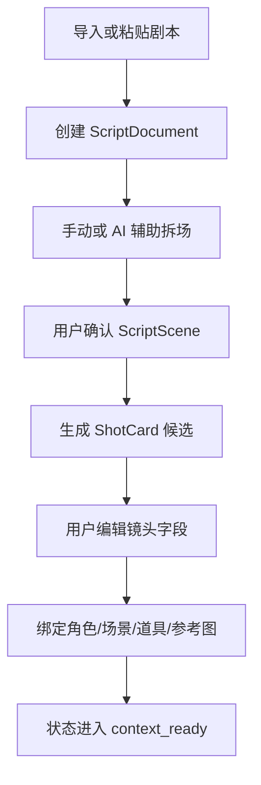
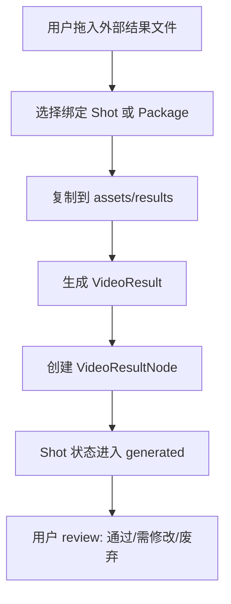

# 04. 剧本、分镜、生成包与结果回收

## 子文档

| 文档 | 作用 |
| --- | --- |
| `script-to-scene.md` | 剧本导入、拆场、候选确认、Scene 生成 |
| `shot-card-lifecycle.md` | ShotCard 字段、必填校验、状态和 review |
| `package-export.md` | 交接包目录、manifest、提示词、参考图、清单 |
| `result-ingestion-and-review.md` | 外部结果回收、take、绑定、review、重做 |

本 README 只作为模块概览；详细规则、字段、状态和验收口径以子文档为准。

## 目标

本设计把创作者从剧本文本推进到 Project Canvas 上的脚本展开表、镜头、Prompt、运行和结果评审，并在需要离线或手工外部生成时导出镜头级 GenerationPackage 作为 handoff/fallback。完整链路必须支持手动编辑、AI 辅助和 Agent Skill/CLI 三种入口，且每一步都能追溯、重做、回退和验收。

## 剧本对象

```ts
interface ScriptDocument {
  id: string
  projectId: string
  title: string
  sourceAssetId?: string
  rawText: string
  logline?: string
  synopsis?: string
  scenes: ScriptScene[]
  createdAt: string
  updatedAt: string
}

interface ScriptScene {
  id: string
  index: number
  title: string
  location: string
  timeOfDay: string
  characters: string[]
  props: string[]
  action: string
  dialogue: DialogueLine[]
  emotionalBeat: string
  sourceRange?: {
    startLine: number
    endLine: number
  }
}

interface DialogueLine {
  characterName: string
  text: string
  intent?: string
}
```

剧本导入后可以手动拆场，也可以发起 AI 任务生成候选场次。AI 输出只能作为候选，用户确认后才写入正式 `scenes`。

## 脚本展开视图

ScriptScene 确认后，工作台可以在 Project Canvas 上生成脚本展开表格视图。该视图按镜号、时长、画面描述、角色、角色描述和角色图组织 Shot 候选，并提供重新生成、生成分镜、下载、脚本视图切换和全屏展开。表格是画布投影和候选编辑面，正式 ShotCard 仍由用户逐行确认后写入。

## ShotCard

```ts
interface ShotCard {
  id: string
  projectId: string
  sceneId?: string
  index: number
  title: string
  description: string
  durationSeconds: number
  aspectRatio: "16:9" | "9:16" | "1:1" | "custom"
  shotType: string
  cameraMovement: string
  cameraAngle?: string
  lensHint?: string
  action: string
  emotion: string
  dialogue?: string
  sfx?: string
  musicHint?: string
  characterIds: string[]
  sceneProfileId?: string
  propIds: string[]
  referenceAssetIds: string[]
  promptId?: string
  packageIds: string[]
  resultIds: string[]
  status: ShotStatus
  review: ReviewRecord[]
}
```

ShotCard 是生产最小单位。每个 Shot 必须能独立导出，也能被场次批量导出。

## 剧本到镜头流程



关键规则：

- 剧本原文不被 AI 任务直接改写；AI 只能生成候选结构或建议。
- ShotCard 必填字段缺失时不能进入 `context_ready`。
- AI 生成的 Shot 候选必须保留来源 PromptRun，用户确认后才成为正式镜头。
- 一个 Scene 可以包含多个 Shot，一个 Shot 只能属于一个主 Scene。

## 分镜表分析与回写

分镜分析可以从剧本文本、参考视频、生成结果、用户备注或 ProductionFrame 的参考组发起。输出先进入候选分镜表，不直接写正式 Shot。

候选分镜行至少包含：

| 字段 | 含义 |
| --- | --- |
| 镜号 | 建议镜头序号或分段号 |
| 画面 | 画面内容、角色动作和关键视觉 |
| 景别 | 远景、中景、近景、特写等 |
| 运镜 | 推、拉、摇、移、跟随、变焦等 |
| 分析 | 情绪、叙事功能、素材使用说明 |
| 剪辑节奏 | 镜头时长、转场、节奏建议 |
| 来源引用 | 使用的剧本段落、资产、ProductionFrame 或 FrameRun |

回写规则：

- 候选行保存在 PromptRun 或 FrameRun 输出中，并保留 provider、能力、输入资产和 contextDigest。
- 用户必须逐行确认后，才允许创建新 Shot 或更新已有 ShotCard 字段。
- 回写时要记录来源候选行、确认人、确认时间和被覆盖字段。
- 无图片或视频理解能力时，参考图和视频节点仍保留在 ProductionFrame 中，但分镜分析只能使用文本描述、用户补充或手动导入的分镜表。
- 视频生成 provider 只负责生成层；它输出的结果可以回收为 VideoResult，再由具备理解能力的 provider 或用户人工分析成新的候选分镜表。

## 提示词与参考图准备

镜头进入 `context_ready` 后，可以执行：

| 任务 | 输入 | 输出 |
| --- | --- | --- |
| 提示词优化 | Shot、角色/场景/道具、风格、用户补充 | PromptObject |
| 多素材融合说明 | 角色图、场景图、道具图、Shot | FusionTask 输出和可选参考图 |
| 连续性检查 | Shot 上下文和锁定规则 | blocking/warning/suggestion |
| 生成前评分 | Prompt、参考资产、目标 profile | 可生成性评分和风险提示 |

这些任务都必须写 PromptRun。用户手动编辑提示词时，也要保留手动版本和编辑时间。

## 画布运行与生成交接包

默认路径是用户或 Agent 在 Project Canvas 选择 Shot、Prompt 或 ProductionFrame，预览上下文和输出契约后发起运行。运行成功后输出回流为 PromptObject、Asset、Take 或 Review 候选；用户确认后进入正式对象。

GenerationPackage 是 handoff/fallback：当 provider 只能手动使用、外发需要用户确认、或用户希望离线交接时，才导出包。

| 路径 | 触发 | 输出 |
| --- | --- | --- |
| 直接运行 | 选中节点 / Frame，选择 ProviderMode | Run/Event/Audit、PromptObject、Asset、Take 候选 |
| Agent 共创 | Agent 通过 Skill/CLI 调用 `run.start` | 同一画布上的候选节点、结果和 audit |
| Handoff fallback | 用户选择导出 Package | GenerationPackage、manifest、上传清单、handoff 状态 |

生成交接包可以按 Shot 导出，也可以按 Scene 批量导出。

```text
packages/
└─ scene_001/
   └─ shot_001_pkg_20260514_102000/
      ├─ manifest.json
      ├─ prompt.txt
      ├─ script_excerpt.md
      ├─ continuity.md
      ├─ upload_checklist.md
      ├─ references/
      │  ├─ characters/
      │  ├─ scenes/
      │  ├─ props/
      │  └─ style/
      └─ storyboard/
```

### manifest.json

```json
{
  "packageType": "video_generation_handoff",
  "schemaVersion": "1.0.0",
  "projectId": "proj_20260514_001",
  "sceneId": "scene_001",
  "shotId": "shot_001",
  "providerProfileId": "provider_manual_handoff",
  "durationSeconds": 5,
  "aspectRatio": "9:16",
  "promptPath": "prompt.txt",
  "scriptExcerptPath": "script_excerpt.md",
  "continuityPath": "continuity.md",
  "uploadChecklistPath": "upload_checklist.md",
  "references": [
    {
      "assetId": "asset_char_main_front",
      "role": "character_ref",
      "path": "references/characters/main_front.png"
    }
  ],
  "createdAt": "2026-05-14T10:20:00+08:00"
}
```

manifest 必须只使用包内相对路径，不能写入固定机器路径。

## 交接包内容标准

| 文件 | 内容 | 验收 |
| --- | --- | --- |
| `manifest.json` | 包结构、对象 ID、引用文件、schema 版本 | JSON 可解析，引用文件存在 |
| `prompt.txt` | 目标 profile 下可复制的提示词 | 包含主提示、连续性、镜头、负面约束 |
| `script_excerpt.md` | 该镜头对应剧本片段和上下文 | 可读，不包含无关全文 |
| `continuity.md` | 人物、场景、道具、风格锁定规则 | 与项目对象一致 |
| `upload_checklist.md` | 用户手动交接步骤和参考图清单 | 可逐项勾选 |
| `references/` | 复制后的参考资产 | 文件名稳定，相对路径被 manifest 引用 |
| `storyboard/` | 可选分镜图或参考图 | 缺失不阻断，但要在 manifest 标记 |

## 结果回收



```ts
interface VideoResult {
  id: string
  projectId: string
  shotId: string
  packageId?: string
  takeNumber: number
  assetId: string
  filePath: string
  source: "manual_import" | "provider_download"
  reviewStatus: "pending" | "approved" | "needs_revision" | "rejected"
  reviewNotes?: string
  createdAt: string
}
```

结果回收要求：

- 同一 Shot 支持多个 take。
- 回收结果不覆盖 Package，也不覆盖 Prompt。
- review 退回必须记录原因，并可选择创建修改任务。
- 结果文件缺失时，VideoResultNode 显示缺失状态，但保留历史记录。

## 失败与恢复

| 场景 | 行为 |
| --- | --- |
| 剧本解析失败 | 保留原文，返回可读错误，允许手动拆场 |
| Shot 必填字段缺失 | 不允许导出包，显示缺失字段列表 |
| 参考图缺失 | 阻断导出或允许用户明确忽略并记录 |
| manifest 引用不一致 | 导出失败，不产生 PackageNode |
| 导出中断 | 保留临时目录，提示清理或重试 |
| 结果绑定错误 | 允许解绑并重新绑定，不删除结果文件 |

## 验收标准

- 导入剧本后可创建 ScriptNode 和至少一个 ScriptScene。
- 手动创建 Shot 后能绑定角色、场景、道具和参考图。
- 缺少必填上下文时，Shot 不能导出生成交接包。
- 导出的包可离线打开，manifest 引用全部存在。
- 重新导出不会覆盖旧包，而是生成新版本目录。
- 拖入结果视频后可绑定到 Shot 并形成 VideoResultNode。
- 同一镜头多个 take 可对比并独立 review。
