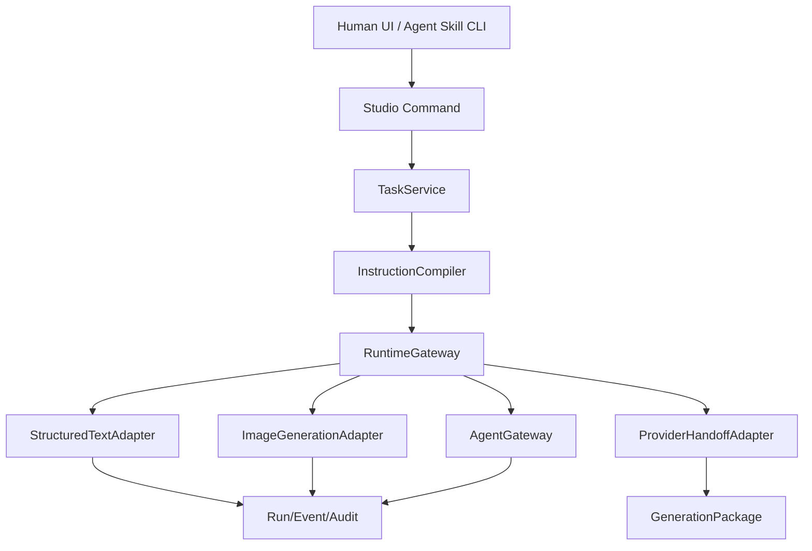
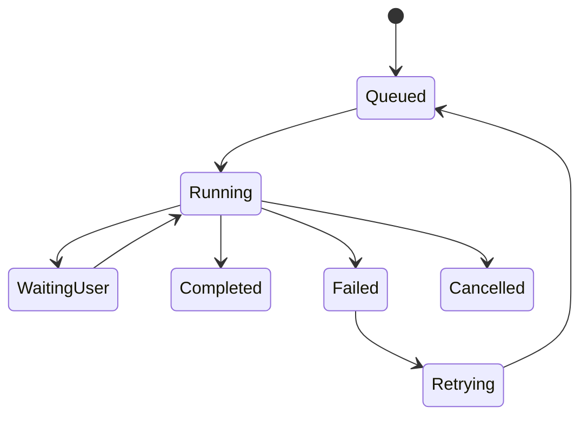

# 06. AI 任务运行时与 Provider 适配器

## 子文档

| 文档 | 作用 |
| --- | --- |
| `runtime-gateway.md` | 运行时接口、ProviderMode、任务生命周期、事件流、权限 |
| `image-generation-adapter.md` | 文生图、参考图改图、多图融合、输出落盘 |
| `provider-handoff-adapter.md` | provider profile、手动交接、未来 API 扩展边界 |
| `provider-configuration-and-credentials.md` | provider profile 复用、项目引用、credentialRef 和系统密钥存储 |
| `runtime-errors-and-retry.md` | 错误码、用户提示、重试、取消、超时、幂等 |

本 README 只作为模块概览；详细规则、字段、状态和验收口径以子文档为准。

## 目标

图屿需要把创作者和 Agent 在 Project Canvas 上选择的镜头上下文交给 AI 任务运行时处理，同时避免把产品架构绑定到某个外部品牌或单一模型。运行时网关负责统一 ProviderMode、任务生命周期、输入包装、事件流、错误语义和产物落盘；provider 适配器负责把图屿内部对象转成特定目标的提示词、参考图、视频任务和交接包格式。

## 分层



| 模块 | 职责 |
| --- | --- |
| Studio Command | 统一接收 UI、CLI、MCP 风格入口和外部 Agent 的画布写操作 |
| TaskService | 接收工作台任务命令，校验 Shot/Asset/Skill/Profile 状态 |
| InstructionCompiler | 编译指令栈、上下文、能力包和输出契约 |
| RuntimeGateway | 统一启动、取消、超时、事件流和错误转换 |
| ProviderCapabilityRegistry | 汇总 provider 的理解能力、生成能力、提交与轮询能力 |
| StructuredTextAdapter | 剧本拆分、提示词优化、连续性检查、评分等结构化文本任务 |
| ImageGenerationAdapter | 文生图、参考图改图、融合参考图任务 |
| ProviderHandoffAdapter | 将镜头上下文导出为目标视频平台可消费的交接包 |
| AgentGateway | 管理 external_agent 模式下的命令、selection、事件和错误归一 |
| PromptRun | 任务运行记录根 |
| GenerationPackage | 交接产物根 |

### Runtime 与 Provider 边界

`RuntimeGateway` 和 `ProviderAdapter` 不应混成一个大接口。

| 边界 | RuntimeGateway | ProviderAdapter |
| --- | --- | --- |
| 面向对象 | 图屿内部任务和 run lifecycle | 某个 provider、HTTP API、CLI 或手动交接目标 |
| 主要职责 | 创建 run/attempt、队列、取消、超时、重试、事件、审计、错误映射 | 构造 prompt、构造 payload/package、校验 provider-specific asset rules、submit/poll/download |
| 写入权限 | 可以通过 ProjectStore 推进 run、Package、Result、audit | 不直接写项目文件，不直接改 Shot/Graph/Package 状态 |
| 错误语义 | 把 adapter error 映射为产品错误码和 recoveryActions | 把 provider 原始错误归一成 adapter error |
| 凭据边界 | 只接收解析后的后端运行配置 | 可以读取 resolver 提供的 secret，但不得返回给前端 DTO |

Capability 和 ProviderMode 决定任务入口，不按 provider 名称硬编码。手动交接是正式 handoff/fallback adapter，不是临时降级路径。

## ProviderMode

| 模式 | 入口 | 输出归一 |
| --- | --- | --- |
| `internal_provider` | Studio 内部 provider/profile/adapter | Run/Event/Audit、PromptRun、Asset、Take |
| `external_agent` | 外部 Agent 读取 Skill 并通过 CLI/MCP 风格命令操作画布 | 同一 Run/Event/Audit、CommandResult、候选节点或结果 |

两者共享 RuntimeGateway、输出契约、路径守卫和审计模型。UI 只区分来源和权限，不建立第二套 Agent 数据模型。

Provider adapter 按能力拆分，不要求所有 provider 实现一个巨型接口：

- `TextUnderstandingAdapter`
- `ImageUnderstandingAdapter`
- `ImageGenerationAdapter`
- `VideoGenerationAdapter`
- `ManualHandoffAdapter`
- `ProviderProfileResolver`

自动 submit/poll 的状态属于 `ProviderAttempt`，不写入 `GenerationPackage.status`。Package 状态仍保持 `draft`、`ready`、`handed_off`、`result_received`、`stale`、`invalid`；外部 provider job 的 `submitted`、`polling`、`provider_result_available` 是另一个维度。

## RuntimeGateway 接口

```go
type RuntimeGateway interface {
    StartTask(ctx context.Context, req RuntimeTaskRequest) (*RuntimeTaskHandle, error)
    CancelTask(ctx context.Context, taskID string) error
    GetTaskStatus(ctx context.Context, taskID string) (*RuntimeTaskStatus, error)
}

type RuntimeTaskRequest struct {
    ProjectID          string
    RunID              string
    ProviderMode       string
    TaskMode           string
    SelectedNodeIDs    []string
    SelectedFrameIDs   []string
    WorkingDirectory   string
    CompiledPromptPath string
    OutputSchemaPath   string
    AssetRefs          []RuntimeAssetRef
    WritableRoots      []string
    NetworkAccess      bool
    TimeoutSeconds     int
}

type RuntimeTaskStatus struct {
    TaskID      string
    State       string
    Progress    float64
    OutputPath  string
    ErrorPath   string
    CompletedAt string
}
```

关键约束：

- `WorkingDirectory` 默认是当前项目目录。
- `WritableRoots` 默认只包含当前项目目录。
- `NetworkAccess` 默认关闭，只有用户明确允许的任务才开启。
- 运行时不能自行决定输出位置，输出路径必须由图屿分配。
- 所有事件转换为图屿内部 `TaskEvent` 并写入 `events.jsonl`。

## 任务生命周期



| 状态 | 进入条件 | 退出 |
| --- | --- | --- |
| `queued` | PromptRun 创建，等待运行资源 | 启动运行 |
| `running` | 运行时已启动并开始发送事件 | 完成、失败、取消、等待用户 |
| `waiting_user` | 运行时需要用户确认或补充输入 | 用户确认或取消 |
| `completed` | 输出文件存在且 schema 校验通过 | 终态 |
| `failed` | 运行时错误、超时、schema 失败、产物缺失 | 可重试或终止 |
| `cancelled` | 用户取消 | 终态，可保留部分产物 |
| `retrying` | 用户选择重试或系统安全重试 | 回到 queued |

## 错误语义

```ts
type RuntimeErrorCode =
  | "runtime_not_configured"
  | "runtime_start_failed"
  | "task_timeout"
  | "permission_denied"
  | "path_rejected"
  | "asset_missing"
  | "output_schema_invalid"
  | "output_missing"
  | "network_required"
  | "provider_profile_missing"
  | "provider_mode_unsupported"
  | "agent_gateway_unavailable"
  | "provider_credential_missing"
  | "provider_capability_missing"
  | "provider_submit_not_configured"
  | "provider_poll_not_configured"
  | "provider_override_rejected"
  | "user_cancelled"
  | "unknown"
```

| 错误 | 用户提示 | 可重试 |
| --- | --- | --- |
| runtime_not_configured | AI 任务运行时未配置 | 配置后可重试 |
| runtime_start_failed | 运行时启动失败 | 可重试 |
| task_timeout | 任务超时 | 可重试，可调大超时 |
| permission_denied | 项目目录不可写或资产不可读 | 修复权限后可重试 |
| path_rejected | 输出或输入路径越界 | 修正路径后可重试 |
| asset_missing | 参考资产缺失 | 补齐资产后可重试 |
| output_schema_invalid | 输出不符合任务契约 | 可重试或手动提取 |
| output_missing | 任务完成但产物未落盘 | 可重试 |
| network_required | 当前任务需要联网但未授权 | 授权后可重试 |
| provider_profile_missing | 缺少目标 profile | 补 profile 后可重试 |
| provider_mode_unsupported | 当前任务不支持所选 ProviderMode | 切换模式或补齐适配器后可重试 |
| agent_gateway_unavailable | Agent 入口未启用或不可达 | 启用 Agent Skill/CLI 后可重试 |
| provider_credential_missing | 当前 profile 缺少可用凭据 | 打开 Provider Settings 配置后可重试 |
| provider_capability_missing | 当前 profile 缺少任务必需能力 | 切换 provider、补充文本描述或改走手动交接 |
| provider_submit_not_configured | 当前 profile 未配置自动提交 | 改走手动交接或切换 profile |
| provider_poll_not_configured | 当前 profile 未配置自动轮询 | 手动导入结果或切换 profile |
| provider_override_rejected | 项目 override 含敏感或非法字段 | 删除非法字段后重试 |
| user_cancelled | 用户取消任务 | 由用户决定 |

## 图像生成适配器

图像生成适配器处理三类任务：

| 任务 | 输入 | 输出 |
| --- | --- | --- |
| 文本生成参考图 | 文字提示、风格、比例、输出路径 | image asset |
| 参考图改图 | local image refs、修改说明、输出路径 | image asset |
| 多图文融合 | 角色图、场景图、道具图、Shot 说明 | fusion prompt 和可选 image asset |

生产要求：

- 输出路径由后端预先分配，例如 `assets/outputs/{run_id}/{asset_id}.png`。
- 任务完成后后端检查文件存在、mime 类型和 digest。
- 生成图片作为 Asset 写入，并绑定 PromptRun。
- 不从运行时自然语言回复中猜测文件位置。
- 失败时保留 compiled prompt 和事件流，方便用户修改后重跑。

## 视频生成与交接适配器

视频生成侧以 capability 声明为准：没有自动生成能力时走手动交接；配置视频生成 provider 后，工作台可以在生产组上启用生成视频入口。

```go
type ProviderHandoffAdapter interface {
    ID() string
    Capabilities() ProviderCapabilities
    BuildPrompt(ctx context.Context, req HandoffPromptRequest) (*ProviderPrompt, error)
    ExportPackage(ctx context.Context, req ExportPackageRequest) (*GenerationPackage, error)
    SubmitPackage(ctx context.Context, pkg GenerationPackage) (*SubmitResult, error)
    PollResult(ctx context.Context, providerJobID string) (*ProviderJobStatus, error)
}
```

默认能力：

| 能力 | 当前行为 |
| --- | --- |
| BuildPrompt | 根据 provider profile 输出可复制提示词 |
| ExportPackage | 导出本地交接包 |
| SubmitPackage | 仅在声明 `apiSubmit` 时启用，否则提示用户手动交接 |
| PollResult | 仅在声明 `pollResult` 时启用，否则提示用户手动回收 |
| VideoGeneration | 仅在声明 `videoGeneration` 时启用生成视频任务，否则保留交接路径 |

未来如果某个外部平台提供稳定接口，可以新增 adapter 实现 `SubmitPackage`、`PollResult` 或视频生成任务，但不能改变 Shot、Package、PromptRun、Asset 的核心数据结构。

## Provider Profile

```ts
interface ProviderProfile {
  id: string
  name: string
  mode: "manual_handoff" | "api_submit"
  promptSections: string[]
  assetRules: {
    maxReferenceImages?: number
    acceptedImageTypes: string[]
    acceptedVideoTypes: string[]
  }
  packageRules: {
    includeManifest: boolean
    includeScriptExcerpt: boolean
    includeContinuity: boolean
    includeUploadChecklist: boolean
  }
  capabilityFlags: {
    textUnderstanding: boolean
    imageUnderstanding: boolean
    videoUnderstanding: boolean
    imageGeneration: boolean
    videoGeneration: boolean
    apiSubmit: boolean
    pollResult: boolean
  }
}
```

Profile 是配置，不是领域模型主语。产品设计只依赖 capability flags 和 package rules。

Provider profile 默认保存在 `~/.tuyu-studio/config/provider_profiles/` 并在多项目间复用。项目目录只保存 `providerProfileId` 和非敏感 override；API key、token、refresh token 等真实凭据只保存到系统密钥存储，并通过 profile 中的 `credentialRef` 引用。详细规则见 `provider-configuration-and-credentials.md`。

能力分两层：

| 能力层 | capability | 影响 |
| --- | --- | --- |
| 理解层 | `textUnderstanding` | 可解析剧本、提示词、分镜表和文本备注 |
| 理解层 | `imageUnderstanding` | 可读取参考图内容并参与提示词或分镜分析 |
| 理解层 | `videoUnderstanding` | 可分析参考视频动作、节奏和镜头信息 |
| 生成层 | `imageGeneration` | 可从生产组生成图片输出 |
| 生成层 | `videoGeneration` | 可从生产组生成视频输出 |
| 接口层 | `apiSubmit` | 可把包或任务提交给外部 provider |
| 接口层 | `pollResult` | 可轮询外部任务并回收结果 |

典型 provider 组合：

| Provider 类型 | 典型 capability | 降级规则 |
| --- | --- | --- |
| 多模态理解运行时 | 文本理解、图片理解、视频理解、可选生成能力 | 可实现完整分镜分析与多模态上下文编译 |
| 文本理解运行时 | 文本理解 | 图片和视频节点保留，要求用户补充文本描述或只跑文本任务 |
| 视频生成运行时 | 视频生成、可选提交和轮询 | 只负责生成层，不假设其具备文本、图片或视频理解能力 |

任务必须按 capability 判断，不按 provider 名称硬编码。缺能力时不删除节点、不破坏 ProductionFrame，只把入口标记为可降级、可预览或不可运行。

## 幂等与重试

| 场景 | 幂等键 | 行为 |
| --- | --- | --- |
| 结构化文本任务重试 | `runId` + `contextDigest` | 创建新 attempt，保留旧输出 |
| 图像生成重试 | `runId` + `attempt` | 新输出路径，不覆盖旧图 |
| 交接包重新导出 | `shotId` + `profileId` + 时间戳 | 新目录，新 Package 版本 |
| 结果回收重复文件 | file digest | 提示复用已有结果或创建新 take |

## 验收标准

- 未配置运行时时，AI 任务按钮显示不可运行原因。
- 每次任务都有 PromptRun 目录和事件流。
- 任务取消后状态为 cancelled，已产生产物不会被当成正式输出。
- 输出 schema 校验失败时不会更新正式对象。
- 图像生成成功后，输出文件由后端校验并写入 Asset。
- 交接包导出不依赖外部接口，manifest 只含相对路径。
- provider profile 切换只影响提示词、生成入口、交接格式和运行状态，不破坏图谱领域对象。
- 缺少媒体理解能力时，工作台能继续保留参考节点并提供文本补充或手动分镜表路径。
- 接入视频生成 provider 后，生产组能启用视频输出任务；未配置时仍保留导出交接包路径。
